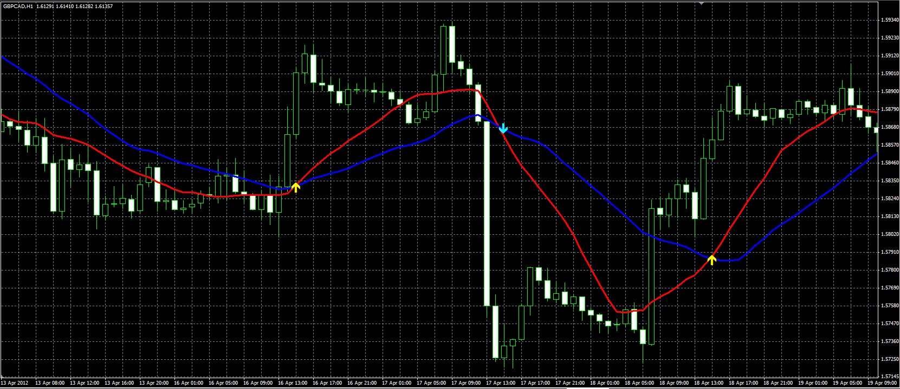

# Two MA cross indicator

> Source: https://fxcodebase.com/code/viewtopic.php?f=38&t=17979  
> Forum: 38 · Topic 17979 · 6 post(s)

---

## Two MA cross indicator

**Alexander.Gettinger** · Tue May 08, 2012 5:00 pm

Original indicator: [viewtopic.php?f=17&t=11038&p=29206#p29206](https://fxcodebase.com/code/viewtopic.php?f=17&t=11038&p=29206#p29206)

> The indicator draws two MA and arrows on their intersections.

 

Download:

 [Two_MA_Cross.mq4](files/32534/Two_MA_Cross.mq4)

---

## Re: Two MA cross indicator

**tadinda** · Mon Jul 02, 2012 6:16 am

Can someone code a sound alert to this and a pop window stating Pair, Direction and Timeframe?

---

## Re: Two MA cross indicator

**Alexander.Gettinger** · Mon Jul 02, 2012 3:13 pm

> **tadinda wrote:**
> Can someone code a sound alert to this and a pop window stating Pair, Direction and Timeframe?

OK. I will write it.

---

## Re: Two MA cross indicator

**Vreneli** · Mon Jul 15, 2013 5:44 pm

Hi,
I am looking for a indikator which gives me a alert if the price crosses a MA.
Every time when Price touches or crosses one MA there should be a alert.

Thanks
Vrenili

---

## Re: Two MA cross indicator

**Apprentice** · Wed Jul 17, 2013 3:44 am

Your request is added to the development list.

---

## Re: Two MA cross indicator

**Alexander.Gettinger** · Mon Dec 17, 2018 9:59 pm

Please try this version of the indicator:

 [Two_MA_Cross.mq4](files/122904/Two_MA_Cross.mq4)
