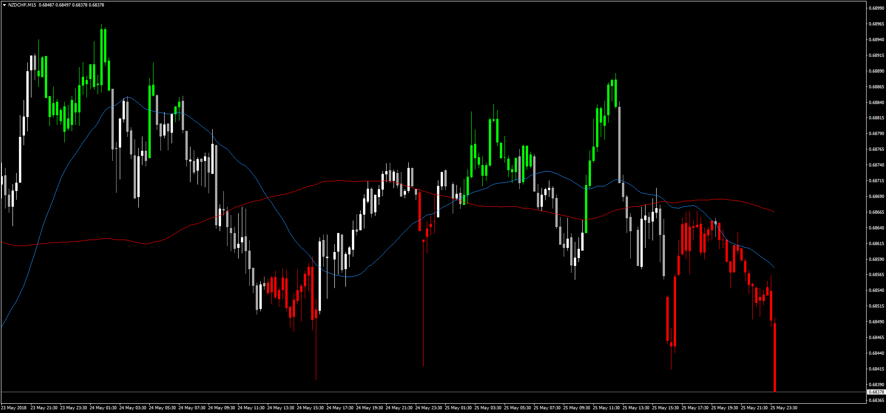

# Two MA Cross Overlay

> Source: https://fxcodebase.com/code/viewtopic.php?f=38&t=66150  
> Forum: 38 · Topic 66150 · 1 post(s)

---

## Two MA Cross Overlay

**Apprentice** · Sun May 27, 2018 6:17 pm

LUA Original: [viewtopic.php?f=17&t=2385](https://fxcodebase.com/code/viewtopic.php?f=17&t=2385)

Description:

This is the MT4 version of the LUA original indicator coloring the candles according to the crossing of two moving averages, which can be one of any of 17 different types.

Green: MA1 above MA2 and price above MA1
Red: Opposite condition
Neutral: Price in between the 2 MA's

 [Two_MA_Cross_Overlay.mq4](files/119371/Two_MA_Cross_Overlay.mq4)
