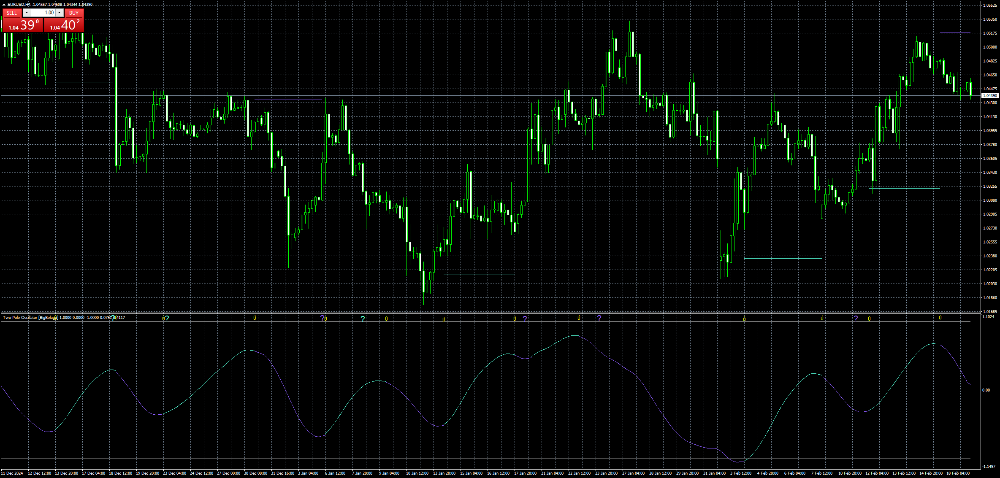
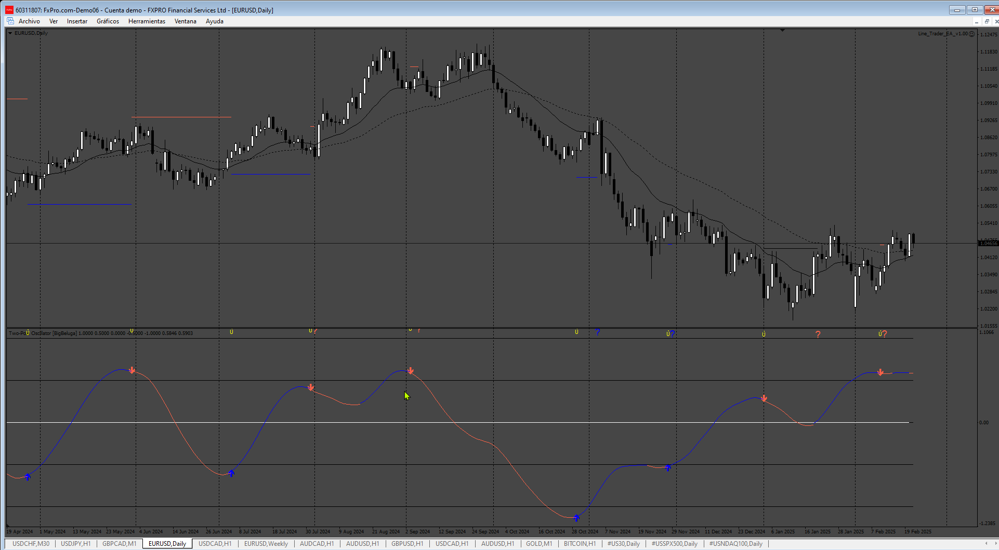

# Two-Pole_Oscillator_5D

> Source: https://fxcodebase.com/code/viewtopic.php?f=38&t=75626  
> Forum: 38 · Topic 75626 · 4 post(s)

---

## Two-Pole_Oscillator_5D

**Apprentice** · Wed Feb 19, 2025 4:11 am

Based on the request.
[https://fxcodebase.com/code/viewtopic.php?f=38&p=158153](https://fxcodebase.com/code/viewtopic.php?f=38&p=158153)

 [Two-Pole_Oscillator_5D.mq4](files/158299/Two-Pole_Oscillator_5D.mq4)

---

## Re: Two-Pole_Oscillator_5D

**Nino1906** · Wed Feb 19, 2025 1:05 pm

Hello, thanks for the work but a few things are missing.
Arrows not showing at all and no alerts popping up and i think not really sure 100% it repaints if you can check. thanks.

---

## Re: Two-Pole_Oscillator_5D

**Apprentice** · Sat Feb 22, 2025 5:38 am

We have added your request to the development list.
Development reference 137

---

## Re: Two-Pole_Oscillator_5D

**Apprentice** · Mon Feb 24, 2025 5:40 am

 [Two_Pole_Oscillator_5D.mq4](files/158376/Two_Pole_Oscillator_5D.mq4)
