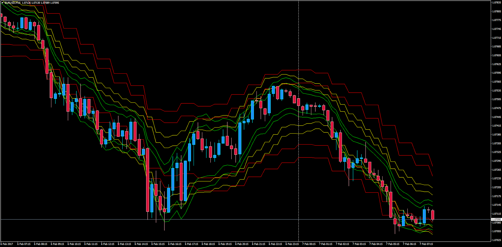

# Tymen SARC Bands MTF

> Source: https://fxcodebase.com/code/viewtopic.php?f=38&t=64417  
> Forum: 38 · Topic 64417 · 1 post(s)

---

## Tymen SARC Bands MTF

**Apprentice** · Tue Feb 07, 2017 4:14 am

LUA Original: [viewtopic.php?f=17&t=2713](https://fxcodebase.com/code/viewtopic.php?f=17&t=2713)
Description:
Multi Time Frame Version of the Tymen SARC Bands with the option to select within 17 different types of moving averages and 3 different time frames. It becomes another interesting study of bands. It has the option to hide the middle lines for better use of the extremes, and also the possibility to chose between smooth or steps MTF bands.

 [TymenSTARCBands_MTF.mq4](files/110945/TymenSTARCBands_MTF.mq4)
