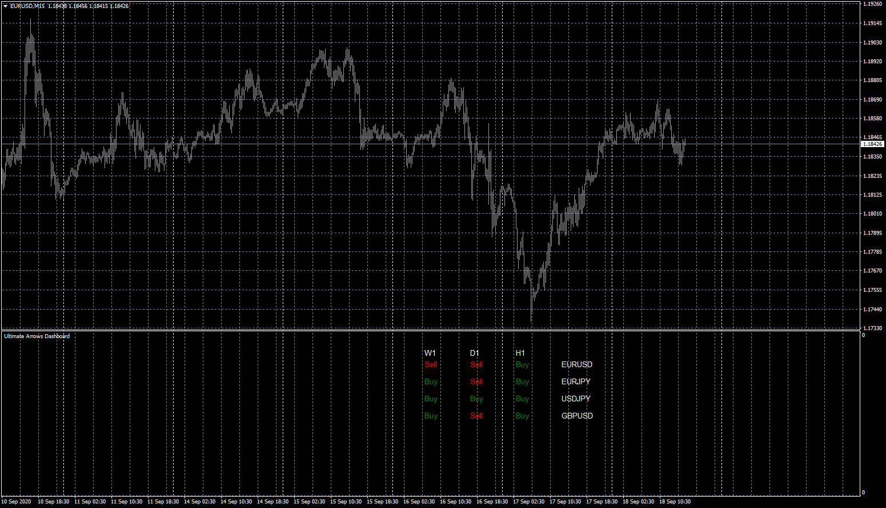

# Ultimate Arrows Dashboard

> Source: https://fxcodebase.com/code/viewtopic.php?f=38&t=70456  
> Forum: 38 · Topic 70456 · 4 post(s)

---

## Ultimate Arrows Dashboard

**Apprentice** · Fri Sep 18, 2020 8:04 am

Based on request.
[viewtopic.php?f=27&t=70172](https://fxcodebase.com/code/viewtopic.php?f=27&t=70172)

 [Ultimate Arrows.mq4](files/137727/Ultimate%20Arrows.mq4)

 [Ultimate Arrows Dashboard.mq4](files/137727/Ultimate%20Arrows%20Dashboard.mq4)

---

## Re: Ultimate Arrows Dashboard

**ras_michael** · Wed Jan 06, 2021 8:48 pm

Apprentice

I saw in the ultimate arrows dashboard you use a historical mode to show the trend since the last signal. is it possible to create a ultimate arrows dashboard using the historical mode only that send an alert when a currency pair is in an uptrend and the 8 ema crosses above the 13 ema or when the a currency pair is in a downtrend and the 8 ema crosses below the 13 ema. i would greatly appreciate it.

thanks.

RAS

---

## Re: Ultimate Arrows Dashboard

**Apprentice** · Thu Jan 07, 2021 3:21 am

Your request is added to the development list.
Development reference 48.

---

## Re: Ultimate Arrows Dashboard

**Apprentice** · Mon Jan 11, 2021 5:48 am

Try this version.
[viewtopic.php?f=38&t=70805](https://fxcodebase.com/code/viewtopic.php?f=38&t=70805)
