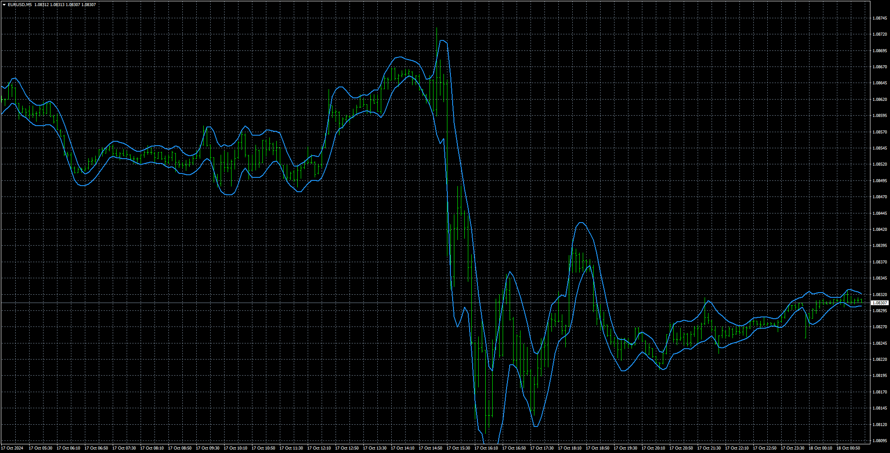

# Ultimate_Channels_and_Ultimate_Bands

> Source: https://fxcodebase.com/code/viewtopic.php?f=38&t=75284  
> Forum: 38 · Topic 75284 · 1 post(s)

---

## Ultimate_Channels_and_Ultimate_Bands

**Apprentice** · Thu Oct 17, 2024 5:28 pm

Based on the request.
[https://fxcodebase.com/code/viewtopic.p ... 15#p155415](https://fxcodebase.com/code/viewtopic.php?f=27&p=155415#p155415)

TASC Issue: May 2024 - Vol. 42, Issue 5
Article: Ultimate Channels And Ultimate Bands
Getting The Lag Out Of Two Classic Indicators
Article By: John F. Ehlers

 [Ultimate_Channels_and_Ultimate_Bands.mq4](files/157013/Ultimate_Channels_and_Ultimate_Bands.mq4)
