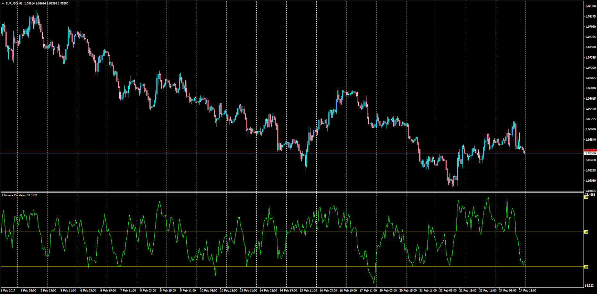

# Ultimate Oscillator

> Source: https://fxcodebase.com/code/viewtopic.php?f=38&t=64482  
> Forum: 38 · Topic 64482 · 1 post(s)

---

## Ultimate Oscillator

**Apprentice** · Sat Feb 25, 2017 6:26 pm

Description:

The Ultimate Oscillator is a momentum oscillator designed to capture momentum across three different time frames. The multiple time frame objective seeks to avoid the pitfalls of other oscillators.

Calculation:
BP = Close - Minimum(Low or Prior Close).
TR = Maximum(High or Prior Close) - Minimum(Low or Prior Close)

Average7 = (7-period BP Sum) / (7-period TR Sum)
Average14 = (14-period BP Sum) / (14-period TR Sum)
Average28 = (28-period BP Sum) / (28-period TR Sum)

UO = 100 x [(4 x Average7)+(2 x Average14)+Average28]/(4+2+1)

 [Ultimate_Oscillator.mq4](files/111198/Ultimate_Oscillator.mq4)
