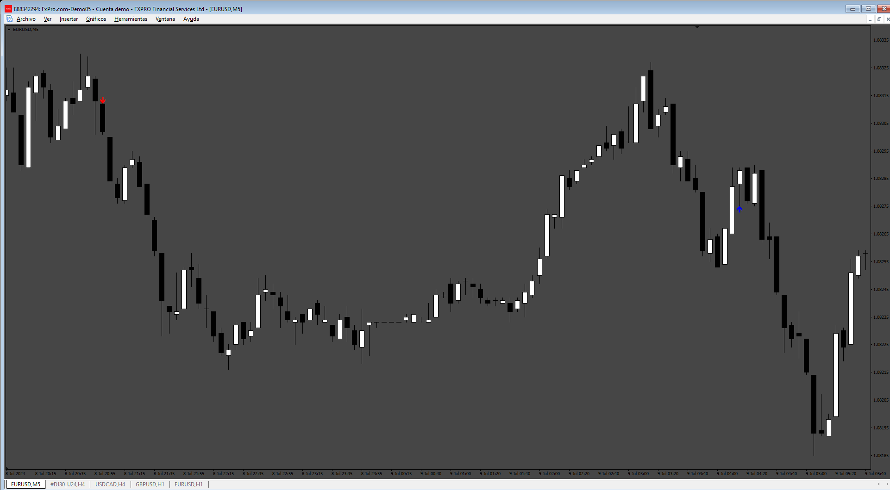
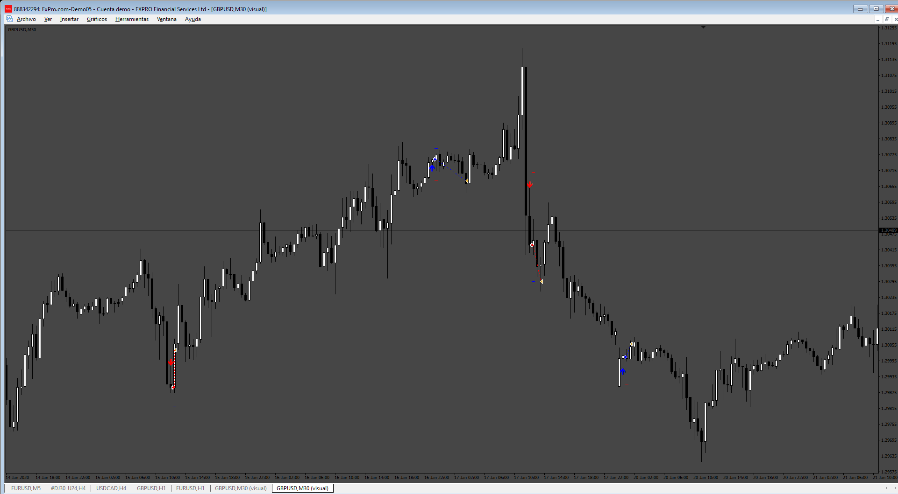

# Umbrella_EA

> Source: https://fxcodebase.com/code/viewtopic.php?f=38&t=75082  
> Forum: 38 · Topic 75082 · 4 post(s)

---

## Umbrella_EA

**Apprentice** · Sat Jul 20, 2024 8:46 am

 

Based on the request.
[https://fxcodebase.com/code/viewtopic.p ... 46#p156146](https://fxcodebase.com/code/viewtopic.php?f=27&p=156146#p156146)

 [Umbrella.mq4](files/156192/Umbrella.mq4)

 [Umbrella_EA.mq4](files/156192/Umbrella_EA.mq4)

---

## Re: Umbrella_EA

**Shadow_eg** · Sun Jul 21, 2024 3:35 pm

Can add in this ea some additional functions?

1. Averaging I think will be good results with averaging. Example if price gone in other way after x pips open new trade in same direction. EA opened buy trade at price 1.09200 we setup after 25 pips open new trade then at 1.09450 opening new buy with multiplier and control max opening trades

2. Close by x money/% for basket mode when ea reached some profit in money or % then close all trades

3. Trading by time with 2 sessions for exaple trade Monday = true session1 start from 3 to 12 session2 start from 19 to 24 for each day the same option. I mean
Monday - true/false
session1
session2

Tuesday - true/false
session1
session2

Wednesday - true/false
session1
session2
etc

4. Not open new trades if drawdown are X in money or %

I think with this functions ea will be much better

---

## Re: Umbrella_EA

**Apprentice** · Mon Jul 22, 2024 3:14 pm

We have added your request to the development list.
Development reference 594

---

## Re: Umbrella_EA

**Apprentice** · Tue Jul 30, 2024 5:05 pm

[Umbrella_EA_v2.mq4](files/156282/Umbrella_EA_v2.mq4)
