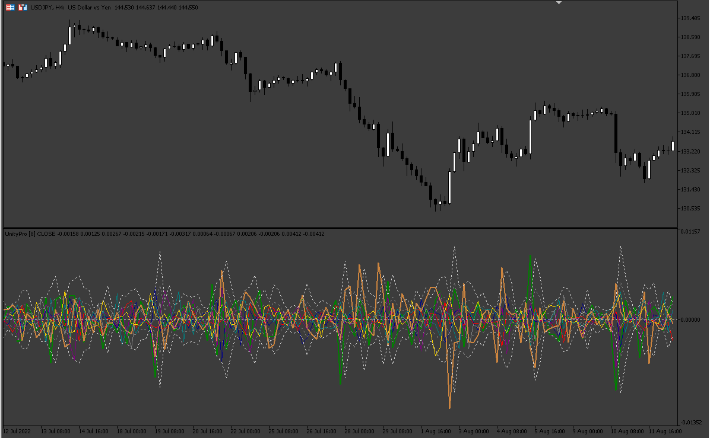

# UnityPro

> Source: https://fxcodebase.com/code/viewtopic.php?f=38&t=72805  
> Forum: 38 · Topic 72805 · 2 post(s)

---

## UnityPro

**Apprentice** · Wed Oct 05, 2022 4:18 am

Based on the request.
[https://fxcodebase.com/code/viewtopic.php?f=27&p=147617](https://fxcodebase.com/code/viewtopic.php?f=27&p=147617)

 [UnityPro.mq5](files/147748/UnityPro.mq5)

There are also two files that need to go to:
\MQL5\Include\CSOM\

 [IndArray.mqh](files/147748/IndArray.mqh)

 [HashMapTemplate.mqh](files/147748/HashMapTemplate.mqh)

---

## Re: UnityPro

**logicgate** · Wed Oct 05, 2022 3:49 pm

thx buddy
