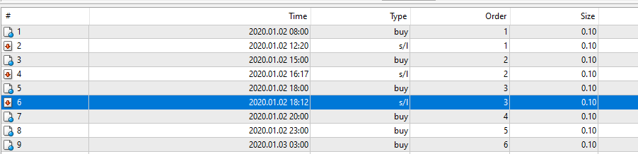

# Universal indicator EA

> Source: https://fxcodebase.com/code/viewtopic.php?f=38&t=70770  
> Forum: 38 · Topic 70770 · 18 post(s)

---

## Universal indicator EA

**Apprentice** · Sun Jan 03, 2021 5:50 am

Based on request.
[viewtopic.php?f=27&t=70193](https://fxcodebase.com/code/viewtopic.php?f=27&t=70193)

 [Universal indicator EA.mq4](files/139937/Universal%20indicator%20EA.mq4)

---

## Re: Universal indicator EA

**rubbbo** · Thu Jan 21, 2021 7:07 am

Hi there!

I am testin this tool but it´s not opening trades.

Does it take the parameters of indicator attached on the chart? or the default indicator´s parameters?

I used an indicator with tw0 buffers, 0 for buy and 1 for sell . Expert is activated for running..

I don´t know if some one else is experiencing this.. Or I am doing something wrong.

I attach some pics and the indicator..

Thank you in advance!

Best regards!

 

 

 

 [31858](files/140302/UNI%20IND-4.png)

 

 [R-PSAROL.mq4](files/140302/R-PSAROL.mq4)

---

## Re: Universal indicator EA

**Apprentice** · Thu Jan 21, 2021 3:07 pm

Your request is added to the development list.
Development reference 107.

---

## Re: Universal indicator EA

**Apprentice** · Sat Jan 30, 2021 8:07 am

---

## Re: Universal indicator EA

**Zelda07** · Sun Feb 27, 2022 6:52 pm

can u share the set files here, because i try my sets presets it did not work

---

## Re: Universal indicator EA

**wanzulkifli** · Fri Apr 08, 2022 11:35 am

hi sorry maybe this is a old thread, but can you make this ea can receive command from 2 different indicators? because i have 2 favourite indicators

---

## Re: Universal indicator EA

**wanzulkifli** · Fri Apr 08, 2022 11:40 am

> **Apprentice wrote:**
> Based on request.
> [viewtopic.php?f=27&t=70193](https://fxcodebase.com/code/viewtopic.php?f=27&t=70193)
>
>
> Universal indicator EA.mq4

hi firstly wanna say sorry because this is an old thread,

but i use your ea this universal indicators and its amazing, can you make it can receive signal from 2 different indicators? because i have 2 favourite custom indicators and sometime the both indicators giving different signals.. thank you.

---

## Re: Universal indicator EA

**Apprentice** · Sat Apr 09, 2022 12:11 pm

Sure.
Can you define the rules and post your request here.
[https://fxcodebase.com/code/viewforum.php?f=27](https://fxcodebase.com/code/viewforum.php?f=27)

Make sure to provide links to all nonstandard indicators.

---

## Re: Universal indicator EA

**akino80** · Sun May 22, 2022 5:08 am

Hi
I not able to get the ea to run with the tsscalp8 indicator. the buffer using is 4 and 5 to buy or sell. The signal i observe will be out on the second candle after the signal candle close. Could you check if the improvement can be done ?

---

## Re: Universal indicator EA

**Apprentice** · Wed May 25, 2022 3:53 am

We have added your request to the development list.
Development reference 312.

---

## Re: Universal indicator EA

**mozart13** · Fri Jun 17, 2022 8:39 am

Would it be possible to ad single MA as filter to Universal indicator EA ?
thx!

---

## Re: Universal indicator EA

**Apprentice** · Mon Jun 20, 2022 11:36 am

We have added your request to the development list.
Development reference 370.

---

## Re: Universal indicator EA

**mozart13** · Wed Sep 21, 2022 10:18 am

Hi Apprentice, it's been a while, this post has fallen behind, when you get chance could you please add single MA filter as option in Universal EA !
thx!

---

## Re: Universal indicator EA

**zanzibar4** · Thu Mar 09, 2023 11:00 am

Good morning,
I kindly ask if it would be possible to add a custom TS to the Universal EA.
That is to say:
- when the gann swing chart indicator gives the bullish arrow
- when the relative candle closes, it opens a buy order and inserts the sl below the bottom (including the shadow) by settable pips.
- at the close of the next candle, the sl moves below the bottom only if it is bullish.
If possible I would be happy.
Thank you.

---

## Re: Universal indicator EA

**Apprentice** · Sat Mar 11, 2023 4:08 am

We have added your request to the development list.
Development reference 230.

---

## Re: Universal indicator EA

**zanzibar4** · Mon Mar 13, 2023 4:56 am

> **Apprentice wrote:**
> We have added your request to the development list.
> Development reference 230.

HI,
to better describe how the Ts works: [https://youtu.be/W6Qb-qZ7rU0](https://youtu.be/W6Qb-qZ7rU0)

---

## Re: Universal indicator EA

**rickCreations** · Sun May 07, 2023 2:52 am

i want to bump this thread.
#1
with any indicator i have tried on buffer 0 for buy and buffer 1 for sell it has not taken any trades in backtest or in live testing.

2#

The signal service to push the signals to Telegram is a dead server the Bot is no longer active and they went to a purchase environment before that. i suggest that the Admins update the Signal Service Code inside this EA to use the free Open Source Github Code so that we can make the bot using @botfather then put in the Token and then also put in our Channel/Group #ID .

---

## Re: Universal indicator EA

**Victor.Tereschenko** · Wed Jan 15, 2025 6:24 am

> **rickCreations wrote:**
> i want to bump this thread.
> #1
> with any indicator i have tried on buffer 0 for buy and buffer 1 for sell it has not taken any trades in backtest or in live testing.
>
> 2#
>
> The signal service to push the signals to Telegram is a dead server the Bot is no longer active and they went to a purchase environment before that. i suggest that the Admins update the Signal Service Code inside this EA to use the free Open Source Github Code so that we can make the bot using @botfather then put in the Token and then also put in our Channel/Group #ID .

Telegram service is back in action
