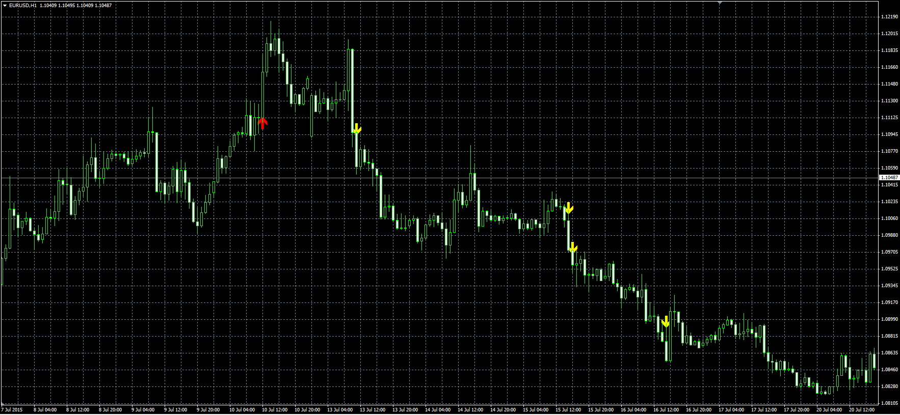

# Unusual Volume Price Movement

> Source: https://fxcodebase.com/code/viewtopic.php?f=38&t=62485  
> Forum: 38 · Topic 62485 · 10 post(s)

---

## Unusual Volume Price Movement

**Alexander.Gettinger** · Wed Jul 29, 2015 7:36 am

Original LUA indicator: [http://www.fxcodebase.com/code/viewtopi ... 17&t=62324](http://www.fxcodebase.com/code/viewtopic.php?f=17&t=62324).

An indication will be given if we have a break on high volume

Up Arrow
Volume> Average_Volume * Multiplier
Price> Highest Price for Last N candle, plus set, Pip / Percentage Value
Down Arrow
Volume> Average_Volume * Multiplier
Price <Lowest Price for Last N candle, minus set, Pip / Percentage Value

 

Download:

 [Unusial_Volume_Price_Momentum.mq4](files/101592/Unusial_Volume_Price_Momentum.mq4)

---

## Re: Unusual Volume Price Movement

**nookie** · Wed Sep 30, 2015 10:17 am

Can you please explain what are those setting for, price, volume . ?

Average lenght>
Price length>
Volume Multiplier >

---

## Re: Unusual Volume Price Movement

**Apprentice** · Thu Oct 08, 2015 4:56 am

Up Arrow
Volume> Average_Volume * Multiplier
Price> Highest Price for Last N candle, plus set, Pip / Percentage Value
Down Arrow
Volume> Average_Volume * Multiplier
Price <Lowest Price for Last N candle, minus set, Pip / Percentage Value

---

## Re: Unusual Volume Price Movement

**nookie** · Thu Jan 28, 2016 1:29 am

Thanks, I am not understanding what is the purpose of the multiplier though. Is it possible indicator to be calculating highest/lowest volume instead of highest/lowest price ?

---

## Re: Unusual Volume Price Movement

**Apprentice** · Fri Jan 29, 2016 5:51 am

if (Volume[pos]<Avg_Vol*Volume_Multiplier)
 {
 Up[pos]=EMPTY_VALUE;
 Dn[pos]=EMPTY_VALUE;
 }

If the volume is less than average volume times multiplier,
indicator arrow will not be drawn.

---

## Re: Unusual Volume Price Movement

**nookie** · Mon Sep 12, 2016 5:37 am

Hi, is it possible we do the reverse logic ? To show an arrow when volume is the lowest value in the last N count of volume bars (selectable) ?

---

## Re: Unusual Volume Price Movement

**Apprentice** · Thu Sep 15, 2016 5:17 am

Will price will affect the result?

---

## Re: Unusual Volume Price Movement

**Alexander.Gettinger** · Sat Jan 20, 2018 12:39 am

> **nookie wrote:**
> Hi, is it possible we do the reverse logic ? To show an arrow when volume is the lowest value in the last N count of volume bars (selectable) ?

Please, try this version of the indicator:

 [Unusial_Volume_Price_Momentum_V.mq4](files/117141/Unusial_Volume_Price_Momentum_V.mq4)

---

## Re: Unusual Volume Price Movement

**nookie** · Fri Jan 26, 2018 3:29 pm

Sorry for the late answer, no price to not affect the result. Thanks Alexander Gettinger

---

## Re: Unusual Volume Price Movement

**nookie** · Fri Jan 26, 2018 3:44 pm

Unusial_Volume_Price_Momentum_V.mq4 Thanks I have tried it but it is showing both high volume from last N and lowest volume from last N.. is it possible to show only lowest from N bars ?

An error is there and I think its not always showing the lowest volume bars from N
