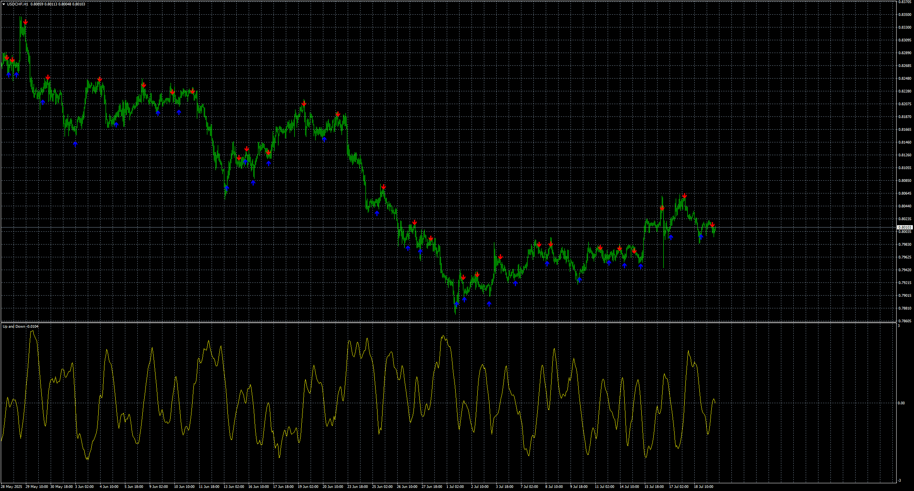
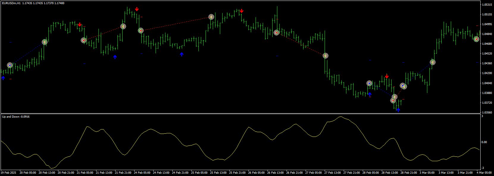
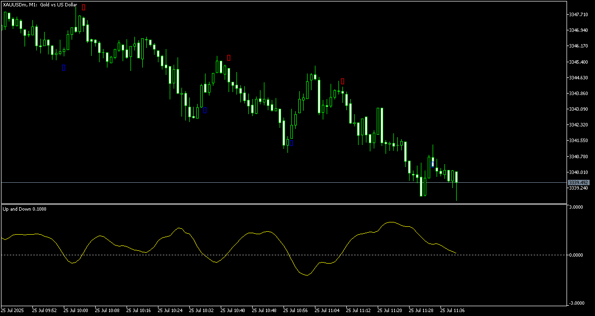
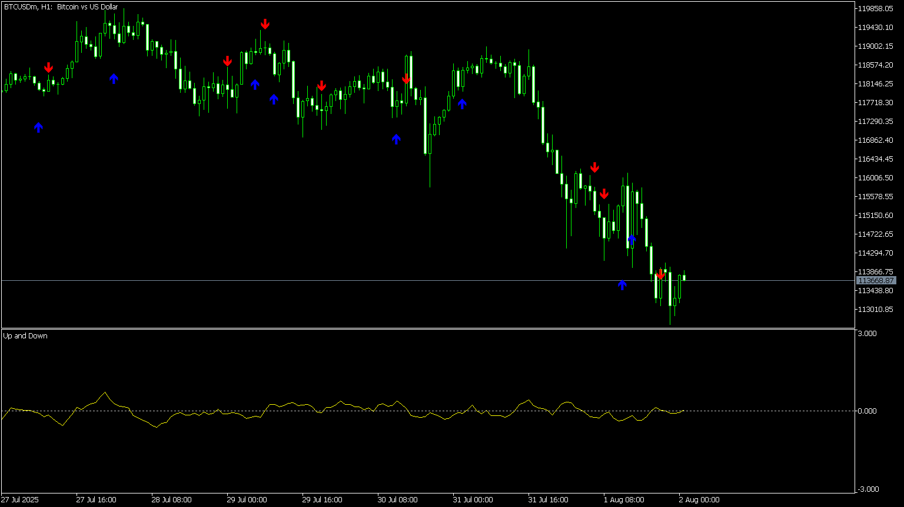

# Up_and_Down Alert

> Source: https://fxcodebase.com/code/viewtopic.php?f=38&t=76170  
> Forum: 38 · Topic 76170 · 9 post(s)

---

## Up_and_Down Alert

**Apprentice** · Mon Jul 21, 2025 5:13 am

Based on the request.
[https://fxcodebase.com/code/viewtopic.p ... 80#p159880](https://fxcodebase.com/code/viewtopic.php?f=27&p=159880#p159880)

 [Up_and_Down Alert.mq4](files/159974/Up_and_Down%20Alert.mq4)

---

## Re: Up_and_Down Alert

**KUSHI90** · Wed Jul 23, 2025 12:40 am

hi sir can make mt5 version
thanks sir

---

## Re: Up_and_Down Alert

**Apprentice** · Wed Jul 23, 2025 3:52 am

We have added your request to the development list.
Development reference 471

---

## Re: Up_and_Down Alert

**Apprentice** · Sun Jul 27, 2025 12:58 pm

 [Up_and_Down_EA.mq4](files/160042/Up_and_Down_EA.mq4)

---

## Re: Up_and_Down Alert

**KUSHI90** · Mon Jul 28, 2025 12:31 am

sir can add option multitimeframe on this indicator, thanks sir

---

## Re: Up_and_Down Alert

**Apprentice** · Mon Jul 28, 2025 4:15 am

 [Up_and_Down_Alert.mq5](files/160055/Up_and_Down_Alert.mq5)

---

## Re: Up_and_Down Alert

**KUSHI90** · Mon Jul 28, 2025 5:58 am

sir could you add function muti timeframe on this indicator?

---

## Re: Up_and_Down Alert

**Apprentice** · Tue Jul 29, 2025 5:35 am

We have added your request to the development list.
Development reference 484

---

## Re: Up_and_Down Alert

**Apprentice** · Mon Aug 04, 2025 3:51 am

 [Up_and_Down_Alert.mq5](files/160121/Up_and_Down_Alert.mq5)
