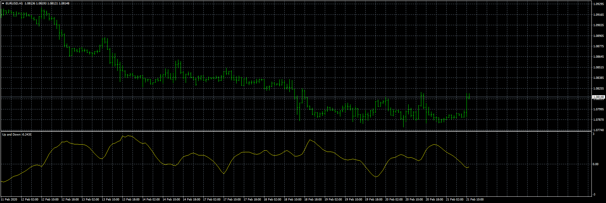

# Up_and_Down

> Source: https://fxcodebase.com/code/viewtopic.php?f=38&t=69435  
> Forum: 38 · Topic 69435 · 24 post(s)

---

## Up_and_Down

**Apprentice** · Fri Feb 21, 2020 6:36 am

Based on request.
[viewtopic.php?f=38&t=69419](https://fxcodebase.com/code/viewtopic.php?f=38&t=69419)

 [Up_and_Down.mq4](files/131415/Up_and_Down.mq4)

 [Up_and_Down HTF.mq4](files/131415/Up_and_Down%20HTF.mq4)

 [Up_and_Down Dashboard.mq4](files/131415/Up_and_Down%20Dashboard.mq4)

---

## Re: Up_and_Down

**durlovjagiroad** · Wed Feb 26, 2020 7:21 am

need Multipair symbol option in this indicator

---

## Re: Up_and_Down

**Apprentice** · Thu Feb 27, 2020 6:03 am

As a dashboard?

Your request is added to the development list.
Development reference 784.

---

## Re: Up_and_Down

**Apprentice** · Fri Feb 28, 2020 6:09 am

Up_and_Down Dashboard.mq4 added.
Please re-download Up_and_Down.mq4

---

## Re: Up_and_Down

**durlovjagiroad** · Fri Feb 28, 2020 11:23 am

> **Apprentice wrote:**
> As a dashboard?
>
> Your request is added to the development list.
> Development reference 784.

No, only option to change to different symbol pair

---

## Re: Up_and_Down

**Apprentice** · Sun Mar 01, 2020 4:06 pm

Your request is added to the development list.
Development reference 795.

---

## Re: Up_and_Down

**idreezz** · Mon Mar 02, 2020 4:23 am

hi. thanks.

The alerts are not working.

kindly do 1 with alerts working and arrows showing on chart because the arrows are not working.

then another one seperately with higher timeframe selection and alerts

---

## Re: Up_and_Down

**Apprentice** · Mon Mar 02, 2020 2:00 pm

Your request is added to the development list.
Development reference 806.

---

## Re: Up_and_Down

**Apprentice** · Tue Mar 03, 2020 6:49 am

Fixed.

---

## Re: Up_and_Down

**idreezz** · Fri Mar 06, 2020 5:41 am

Thank you very much.
you are the best

But the notifications is still working. that's the only thing remaining.

---

## Re: Up_and_Down

**idreezz** · Mon Mar 09, 2020 5:14 am

> **idreezz wrote:**
> Thank you very much.
> you are the best
>
>
> But the notifications is still working. that's the only thing remaining.

I meant not working. thank you

---

## Re: Up_and_Down

**Apprentice** · Tue Mar 10, 2020 6:34 am

[Up_and_Down.mq4](files/131843/Up_and_Down.mq4)

Fixed.

---

## Re: Up_and_Down

**durlovjagiroad** · Sat Apr 11, 2020 12:17 pm

Need Expert advisor
Buy- when 5M signal line crosses up 15 M line
Sell -when 5M signal line crosses down 15 M line

---

## Re: Up_and_Down

**Apprentice** · Sun Apr 12, 2020 9:50 am

Your request is added to the development list.
Development reference 1050.

---

## Re: Up_and_Down

**Apprentice** · Sun Apr 19, 2020 7:49 am

Try this version.

 [Up And Down EA.mq4](files/132955/Up%20And%20Down%20EA.mq4)

---

## Re: Up_and_Down

**yutredo** · Tue Apr 21, 2020 7:19 am

hello apprentice;

is it possible to make simple expert advisor based on arrows buy sell signs?

thanks

---

## Re: Up_and_Down

**Apprentice** · Tue Apr 21, 2020 9:14 am

Something like above posted Up And Down EA.mq4?

---

## Re: Up_and_Down

**yutredo** · Tue Apr 21, 2020 9:30 am

hello apprentice;

i just want something basic when buy arrow appears buy when sell arrow appears sell very basic not complicated

---

## Re: Up_and_Down

**Apprentice** · Wed Apr 22, 2020 10:35 am

Multi-currency pair based on Up_and_Down Dashboard.mq4?

---

## Re: Up_and_Down

**yutredo** · Wed Apr 22, 2020 12:13 pm

> **Apprentice wrote:**
> Multi-currency pair based on Up_and_Down Dashboard.mq4?

i dont get it?

---

## Re: Up_and_Down

**Apprentice** · Thu Apr 23, 2020 4:22 am

Have you tried Up And Down EA.mq4?
If yes, why it is not agreeable?

---

## Re: Up_and_Down

**yutredo** · Thu Apr 23, 2020 6:24 am

> **Apprentice wrote:**
> Have you tried Up And Down EA.mq4?
> If yes, why it is not agreeable?

i tried to attach it to chart but it doesnt work can you take a look at?

---

## Re: Up_and_Down

**Apprentice** · Thu Apr 23, 2020 7:33 am

Your request is added to the development list.
Development reference 1118.

---

## Re: Up_and_Down

**Apprentice** · Fri Apr 24, 2020 1:27 pm

Try this version.
