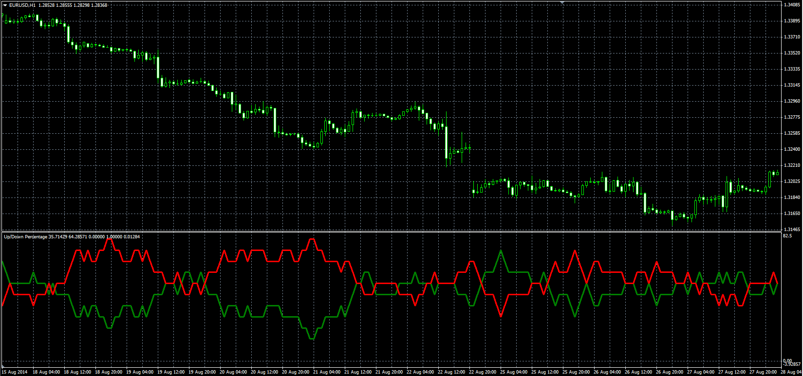

# Up/Down Percentage

> Source: https://fxcodebase.com/code/viewtopic.php?f=38&t=61236  
> Forum: 38 · Topic 61236 · 1 post(s)

---

## Up/Down Percentage

**Alexander.Gettinger** · Tue Sep 23, 2014 10:51 am

Original LUA oscillator: [viewtopic.php?f=17&t=27741](https://fxcodebase.com/code/viewtopic.php?f=17&t=27741).

Formulas:
UP = MVA(UpF) with [Length] number of periods,
DN = MVA(DnF) with [Length] number of periods, where
UpF = 1, if Price[i]>Price[i-1], else UpF[i] = 0,
DnF = 1, if Price[i]<Price[i-1], else DnF[i] = 0.

 

Download:

 [UDP.mq4](files/96136/UDP.mq4)
