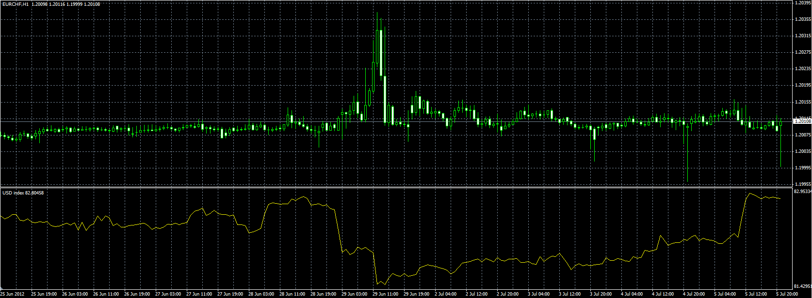
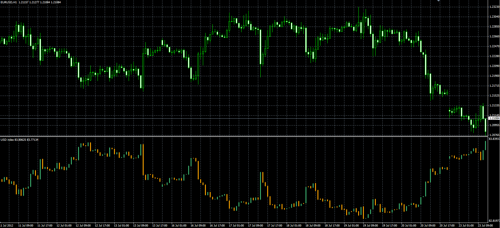

# US Dollar Index

> Source: https://fxcodebase.com/code/viewtopic.php?f=38&t=20873  
> Forum: 38 · Topic 20873 · 9 post(s)

---

## US Dollar Index

**Alexander.Gettinger** · Thu Jul 05, 2012 4:45 pm

Original indicator: [viewtopic.php?f=17&t=609](https://fxcodebase.com/code/viewtopic.php?f=17&t=609)

> The USD Index measures the performance of the US Dollar against a basket of currencies.
>
> USDX := 50.14348112 × EURUSD-0.576 × USDJPY0.136 × GBPUSD-0.119 × USDCAD0.091 × USDSEK0.042 × USDCHF0.036
>
> Please, note, that you must be subscribed for all instruments required to calculation: EUR/USD, USD/JPY, GBP/USD, USD/CAD, USD/SEK and USD/CHF. If at least one of the instruments is not subscribed, the indicator fails!

 

Download:

 [USDX.mq4](files/36559/USDX.mq4)

---

## Re: US Dollar Index

**Alexander.Gettinger** · Mon Jul 23, 2012 10:17 am

USDX candle indicator.

 

Download:

 [USDX_Candle.mq4](files/37165/USDX_Candle.mq4)

The indicator draws only the open and close prices, the high and low prices to be determined.

---

## Re: US Dollar Index

**Jeffreyvnlk** · Mon Oct 22, 2012 9:59 pm

Appreciated if you could make EUR , GBP,AUD and JPY index just like that

---

## Re: US Dollar Index

**Apprentice** · Tue Oct 23, 2012 6:07 am

This is request for MT4 or TS / MarketScope.

---

## Re: US Dollar Index

**Apprentice** · Tue Oct 23, 2012 10:26 am

EURX calculation according to foreign trade of EU.
 USA (31.55%), Great Britain (30.56%), Switzerland (11.13%), Japan (11.13%), and Sweden (7.85%).

 [EURX.mq4](files/42674/EURX.mq4)

You need to be subscribed to the following currency pairs "EURUSD", "EURGBP", "EURJPY", "EURSEK", "EURCHF";

---

## Re: US Dollar Index

**Jeffreyvnlk** · Tue Oct 23, 2012 10:09 pm

> **Apprentice wrote:**
> EURX calculation according to foreign trade of EU.
> USA (31.55%), Great Britain (30.56%), Switzerland (11.13%), Japan (11.13%), and Sweden (7.85%).
>
>
> EURX.mq4
>
>
>
> You need to be subscribed to the following currency pairs "EURUSD", "EURGBP", "EURJPY", "EURSEK", "EURCHF";

Thank you very much. Your work so great, keep it up

---

## Re: US Dollar Index

**mankco** · Fri Jan 17, 2014 5:05 am

Hi Apprentice,
could you help us to create mq4 indicators of similar line and candles version of indexes of usd, jpy, eur, cad, aud LFX etc., formula as shown in the attached picture.

many thanks for help.

---

## Re: US Dollar Index

**Apprentice** · Fri Jan 17, 2014 12:02 pm

Your request is added to the development list.

---

## Re: US Dollar Index

**Alexander.Gettinger** · Wed Jan 22, 2014 4:46 pm

> **mankco wrote:**
> Hi Apprentice,
> could you help us to create mq4 indicators of similar line and candles version of indexes of usd, jpy, eur, cad, aud LFX etc., formula as shown in the attached picture.
>
> many thanks for help.

Please, see this indicator: [viewtopic.php?f=38&t=20874&p=36561](https://fxcodebase.com/code/viewtopic.php?f=38&t=20874&p=36561).
