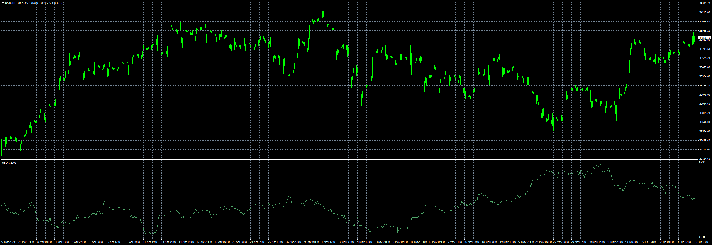

# USD Index

> Source: https://fxcodebase.com/code/viewtopic.php?f=38&t=73815  
> Forum: 38 · Topic 73815 · 1 post(s)

---

## USD Index

**Apprentice** · Sat Jun 10, 2023 3:42 am

USD = (usdjpy/100 + usdcad + 1/gbpusd + 1/eurusd + usdchf + 1/audusd + 1/nzdusd)/7

 [USD Index.mq4](files/151182/USD%20Index.mq4)
