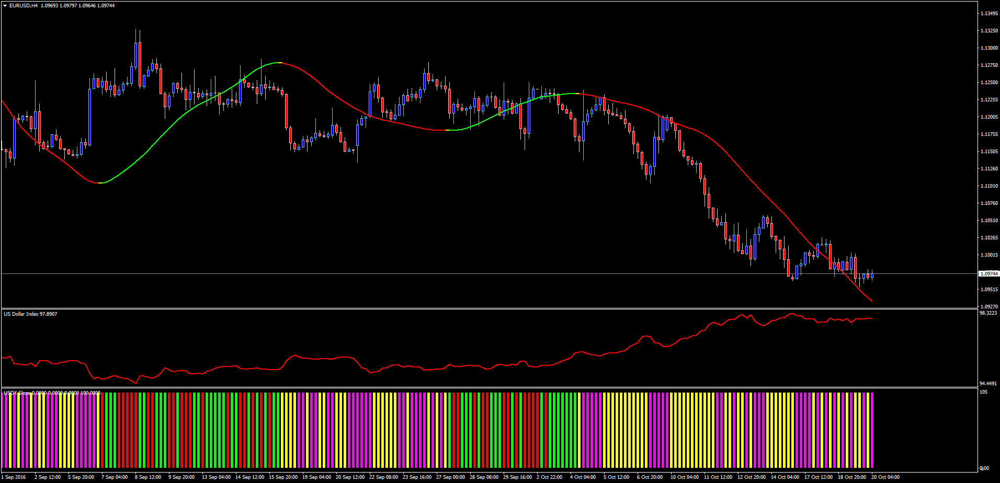

# USDX Slope

> Source: https://fxcodebase.com/code/viewtopic.php?f=38&t=63997  
> Forum: 38 · Topic 63997 · 1 post(s)

---

## USDX Slope

**Apprentice** · Thu Oct 20, 2016 3:37 am

LUA Original: [viewtopic.php?f=17&t=2304](https://fxcodebase.com/code/viewtopic.php?f=17&t=2304)

Description:

This indicator (Colored Histogram) uses other 2 indicators:

- Slope Direction Line (Attached independently): A Moving Average indicator that allows to assess the direction of the market by smoothing the trend using a vectorial formula. Any off the default Moving Averages can be used as source as well as the type of price and number of periods.

- USDX (Also attached independently): The well known US Dollar Index, which is a geometrically-averaged calculation developed in 1973 by the US Federal Reserve of six currencies weighted against the U.S. dollar.

This USDX Slope Histogram will be colored according to the following scenarios:

UpUp: Slope Line going Up and current USDX greater than previous USDX (Lime)
DnUp: Slope Line going up and current USDX lower than previous USDX (Yellow)
UpDn: Slope Line going down and current USDX greater than previous USDX (Red)
DnDn: Slope Line going down and current USDX lower than previous USDX (Magenta)

For ease of use, both calculations of the above described indicators were incorporated into the histogram.

 [Slope_Direction_Line.mq4](files/108692/Slope_Direction_Line.mq4)

 [USDX.mq4](files/108692/USDX.mq4)

 [USDX_Slope.mq4](files/108692/USDX_Slope.mq4)
