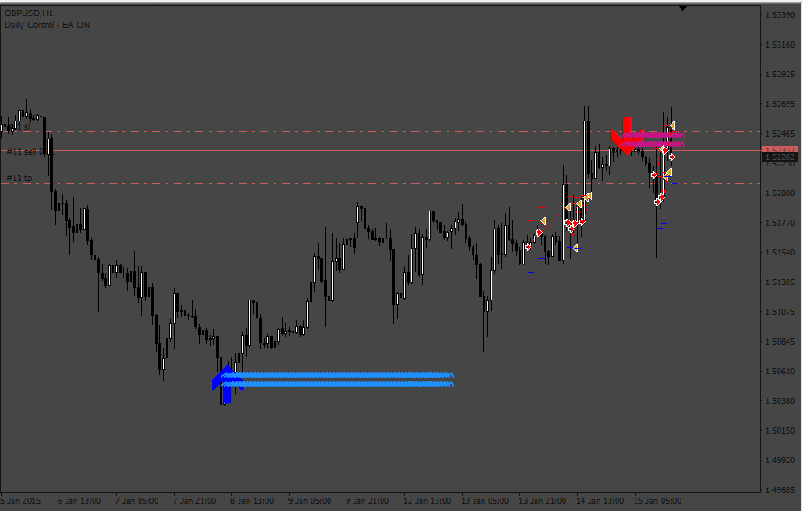

# Use_Extren_Indicator_EA

> Source: https://fxcodebase.com/code/viewtopic.php?f=38&t=73714  
> Forum: 38 · Topic 73714 · 1 post(s)

---

## Use_Extren_Indicator_EA

**Apprentice** · Sat May 13, 2023 10:29 am

Based on the request.
[https://fxcodebase.com/code/viewtopic.php?f=38&t=73682](https://fxcodebase.com/code/viewtopic.php?f=38&t=73682)

 [Use_Extren_Indicator_EA.mq4](files/150818/Use_Extren_Indicator_EA.mq4)

 [Mango-indicator.ex4](files/150818/Mango-indicator.ex4)

The indicator repaints a lot and is hard to use in an EA

 the signals can be something like this:

Buy
 if (iCustom(NULL, 0, file_custom_indicator, 6, 1) != 0) { return true; }
 return false;

Sell
 if (iCustom(NULL, 0, file_custom_indicator, 7, 1) != 0) { return true; }
 return false;
