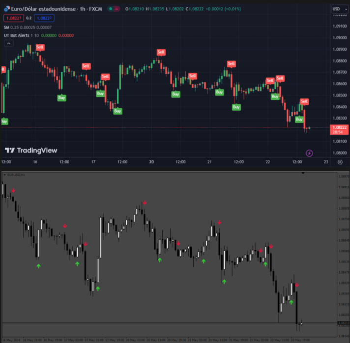
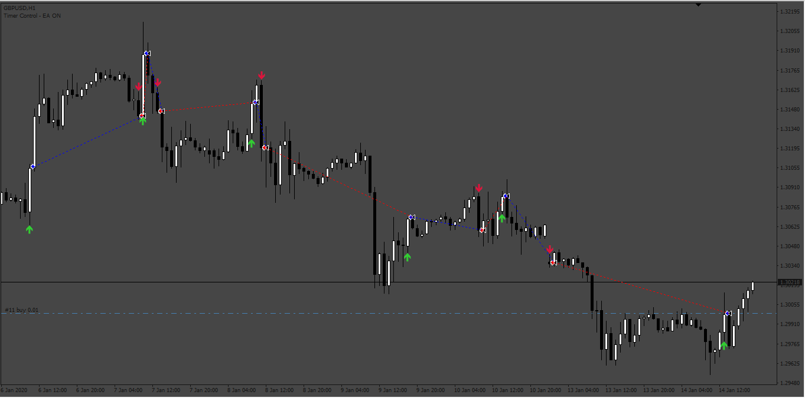
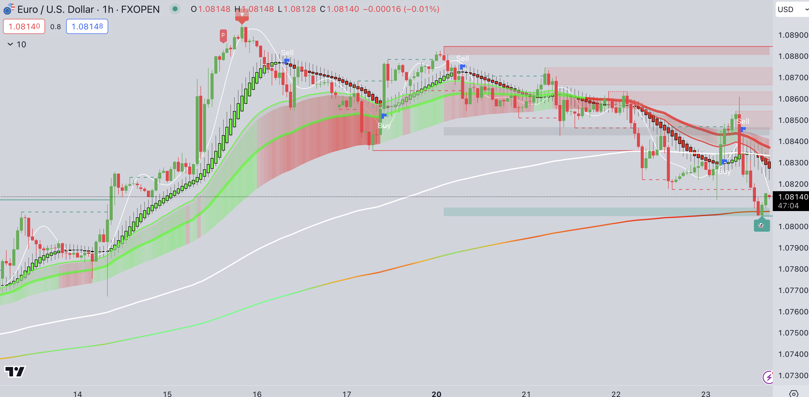
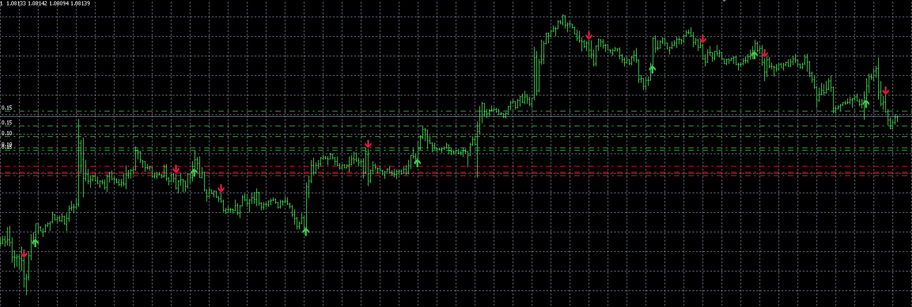

# ut_bot_exact_ea

> Source: https://fxcodebase.com/code/viewtopic.php?f=38&t=74898  
> Forum: 38 · Topic 74898 · 4 post(s)

---

## ut_bot_exact_ea

**Apprentice** · Thu May 23, 2024 1:33 pm

 

Based on the request.
[https://fxcodebase.com/code/viewtopic.php?f=27&p=155309](https://fxcodebase.com/code/viewtopic.php?f=27&p=155309)

 [ut_bot_exact.mq4](files/155466/ut_bot_exact.mq4)

 [ut_bot_exact_ea.mq4](files/155466/ut_bot_exact_ea.mq4)

---

## Re: ut_bot_exact_ea

**trtrader** · Thu May 23, 2024 4:15 pm

Thanks a lot but I am getting completely different entries for settings 3, 10.

could you please double check what can be the reason?

 

 

---

## Re: ut_bot_exact_ea

**Apprentice** · Tue May 28, 2024 5:15 am

We have added your request to the development list.
Development reference 440

---

## Re: ut_bot_exact_ea

**Apprentice** · Wed Oct 01, 2025 5:44 am

The MT4 indicator has been tested and compared with the TradingView version on multiple instruments and timeframes using the 3 and 10 settings. On higher timeframes (where the price differences between brokers are very small, which is important), the sell and buy signals appear at exactly the same points.
