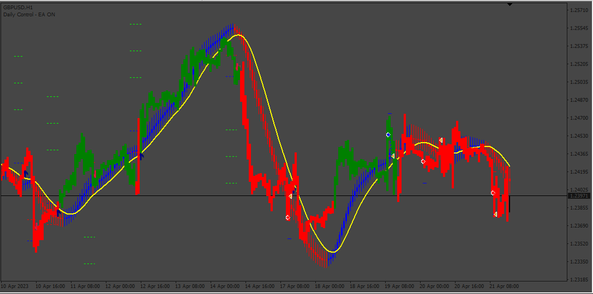

# UT_Bot_v2

> Source: https://fxcodebase.com/code/viewtopic.php?f=38&t=74051  
> Forum: 38 · Topic 74051 · 6 post(s)

---

## UT_Bot_v2

**Apprentice** · Fri Aug 18, 2023 12:19 pm

Based on the request.
[https://fxcodebase.com/code/viewtopic.php?f=38&t=73969](https://fxcodebase.com/code/viewtopic.php?f=38&t=73969)

 [STC_Indicator.mq4](files/152134/STC_Indicator.mq4)

 [Linear_Regression_Bar.mq4](files/152134/Linear_Regression_Bar.mq4)

 [UT_Bot_v2.mq4](files/152134/UT_Bot_v2.mq4)

 [LinearReg_STC_UTBot_EA.mq4](files/152134/LinearReg_STC_UTBot_EA.mq4)

---

## Re: UT_Bot_v2

**sohaib2009** · Mon Jan 08, 2024 9:54 am

Hello Admin,

I have used your Expert Advisor (EA) and found it very good. However, could you please clarify whether the old signal will close after a new signal appears?

---

## Re: UT_Bot_v2

**Apprentice** · Wed Jan 10, 2024 7:16 am

We have added your request to the development list.
Development reference 42

---

## Re: UT_Bot_v2

**sohaib2009** · Tue Jan 16, 2024 8:57 am

> **Apprentice wrote:**
> We have added your request to the development list.
> Development reference 42

Hello Admin

Hope u will fine.

Sir any development in UT BOT v2 ?

Thanks

---

## Re: UT_Bot_v2

**sohaib2009** · Fri Jan 19, 2024 9:17 am

> **Apprentice wrote:**
> We have added your request to the development list.
> Development reference 42

Sir any development ?

---

## Re: UT_Bot_v2

**Apprentice** · Wed Oct 01, 2025 5:43 am

[STC_Indicator.mq4](files/160689/STC_Indicator.mq4)

 [Linear_Regression_Bar.mq4](files/160689/Linear_Regression_Bar.mq4)

 [UT_Bot_v2.mq4](files/160689/UT_Bot_v2.mq4)

 [LinearReg_STC_UTBot_EA.mq4](files/160689/LinearReg_STC_UTBot_EA.mq4)
