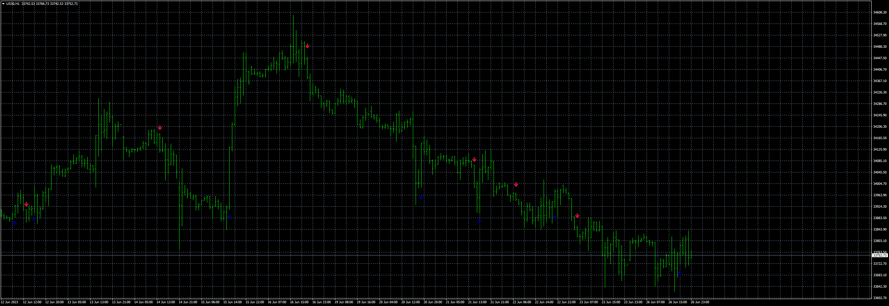

# UT Bot

> Source: https://fxcodebase.com/code/viewtopic.php?f=38&t=73874  
> Forum: 38 · Topic 73874 · 4 post(s)

---

## UT Bot

**Apprentice** · Mon Jun 26, 2023 3:28 pm

Based on the request.
[https://fxcodebase.com/code/viewtopic.php?f=27&p=151282](https://fxcodebase.com/code/viewtopic.php?f=27&p=151282)

 [UT Bot.mq4](files/151428/UT%20Bot.mq4)

 [uBot.mq5](files/151428/uBot.mq5)

---

## Re: UT Bot

**mhlangak** · Sun Jul 09, 2023 8:57 pm

> **Apprentice wrote:**
>
>
> us30-h1-fxcm-australia-pty.png
>
>
> Based on the request.
> [https://fxcodebase.com/code/viewtopic.php?f=27&p=151282](https://fxcodebase.com/code/viewtopic.php?f=27&p=151282)
>
>
> UT Bot.mq4

Hey coders can you please add feature that can be changed on input if possible for arrows to appear on current bar and after bar close

And also arrow gap feature sometimes when I change settings some arrows are far from the candles so I want to be able to adjust them to be on near the bars

And also bars limit of 500 which can be adjustable too

---

## Re: UT Bot

**Apprentice** · Mon Jul 10, 2023 5:19 am

We have added your request to the development list.
Development reference 601.

---

## Re: UT Bot

**Apprentice** · Tue Jul 11, 2023 7:44 am

[UT_Bot.mq4](files/151600/UT_Bot.mq4)

Try this version.
