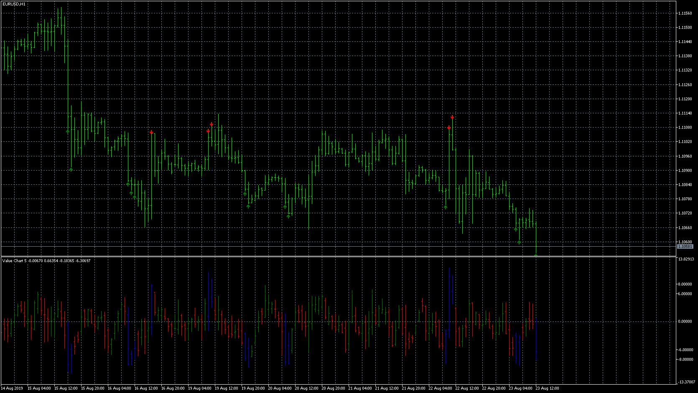
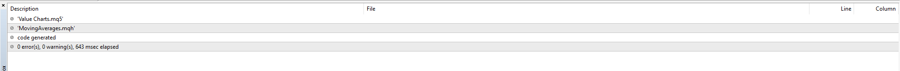

# Value Charts (MT5)

> Source: https://fxcodebase.com/code/viewtopic.php?f=38&t=68840  
> Forum: 38 · Topic 68840 · 7 post(s)

---

## Value Charts (MT5)

**Apprentice** · Fri Aug 23, 2019 6:46 am

Based on request.
[viewtopic.php?f=27&t=68828](https://fxcodebase.com/code/viewtopic.php?f=27&t=68828)

 [Value Charts.mq5](files/128159/Value%20Charts.mq5)

---

## Re: Value Charts (MT5)

**logicgate** · Fri Aug 23, 2019 11:04 am

Still getting the errors my friend:

---

## Re: Value Charts (MT5)

**Apprentice** · Tue Aug 27, 2019 7:27 am

You will have to install movingaverages.mqh

---

## Re: Value Charts (MT5)

**logicgate** · Tue Aug 27, 2019 8:38 am

Hi there my friend.

But I checked the folder it is trying to access and the movingaverages.mqh is already there, that is why I don´t understand.

Can you post here the compile indi instead of .mq4? Perhaps it is gonna work.

---

## Re: Value Charts (MT5)

**Apprentice** · Wed Aug 28, 2019 11:20 am

It looks like you're trying to compile the file in MT4 version or Meta editor.
This is the MT5 indicator, you should use MT5 version or Meta editor.

---

## Re: Value Charts (MT5)

**logicgate** · Wed Aug 28, 2019 1:23 pm

I am using the right editor, and I checked the folder it is looking into for the movingaverages.mqh, it is there...

---

## Re: Value Charts (MT5)

**logicgate** · Wed Aug 28, 2019 4:43 pm

Ok I got it now, it was looking into the installation folder for the MAs, not the data folder.
