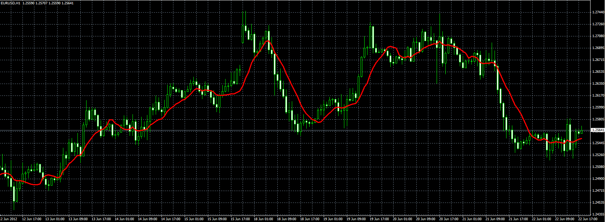

# VAMA

> Source: https://fxcodebase.com/code/viewtopic.php?f=38&t=20488  
> Forum: 38 · Topic 20488 · 1 post(s)

---

## VAMA

**Alexander.Gettinger** · Fri Jun 22, 2012 2:22 pm

Original indicator: [viewtopic.php?f=17&t=2349](https://fxcodebase.com/code/viewtopic.php?f=17&t=2349)

Formulas:
VAMA=MA(VPrice)/MA(Volume), where
VPrice=Price*Volume,
MA - simple moving average with length as period.

 

Download:

 [VAMA.mq4](files/35910/VAMA.mq4)
