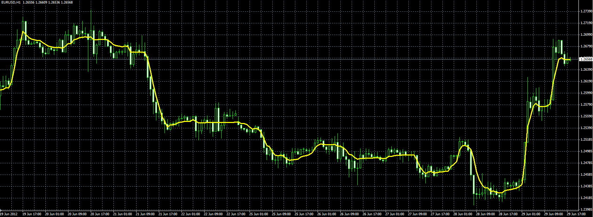

# Variable Moving Average(VARMA)

> Source: https://fxcodebase.com/code/viewtopic.php?f=38&t=20682  
> Forum: 38 · Topic 20682 · 1 post(s)

---

## Variable Moving Average(VARMA)

**Alexander.Gettinger** · Fri Jun 29, 2012 1:52 pm

Original indicator: [viewtopic.php?f=17&t=3521](https://fxcodebase.com/code/viewtopic.php?f=17&t=3521)

> Variable moving average is an exponential moving average that automatically adjusts the smoothing constant based on the volatility of the data series. The more volatile the data, the larger the smoothing constant used in the moving average calculation. The larger the smoothing constant, the more weight given to the current data. The opposite is true for less volatile data.
>
> Typical moving averages suffer from the inability to compensate for changes in volatility. During volatile markets, you want a moving average to increase its sensitivity, so that you will quickly be on the correct side of any wild gyrations. By automatically adjusting the smoothing constant, a variable moving average is able to adjust its sensitivity, allowing it to perform better in both high and low volatility markets.

Formulas:
AbsCMO:=(Abs(CMO(Close,CMOPeriod)))/100;
SC:=2/(SmoothPeriod+1);
if period > CMOPeriod + SmoothPeriod+ 2 then
VARMA=(SC*AbsCMO*C)+(1-(SC*AbsCMO))*VARMA[PREV]);
else
VARMA = Close
end

 

Download:

 [VARMA.mq4](files/36264/VARMA.mq4)

For VARMA must be installed CMO oscillator ([viewtopic.php?f=38&t=20681](https://fxcodebase.com/code/viewtopic.php?f=38&t=20681)).
