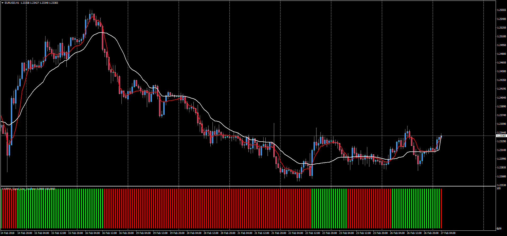
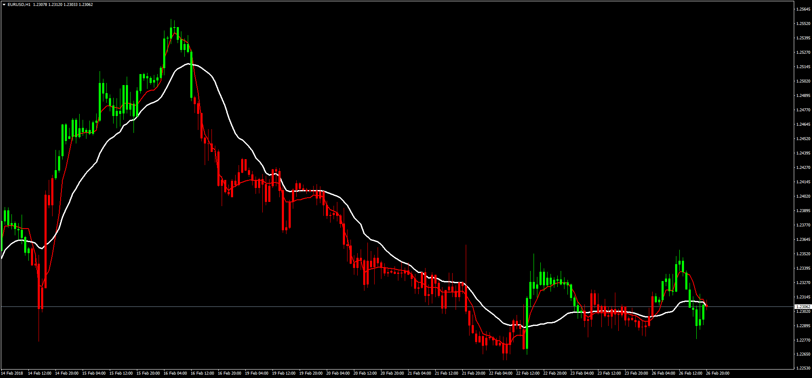

# VARMA Signal Line Overlay & Oscillator

> Source: https://fxcodebase.com/code/viewtopic.php?f=38&t=65778  
> Forum: 38 · Topic 65778 · 1 post(s)

---

## VARMA Signal Line Overlay & Oscillator

**Apprentice** · Tue Feb 27, 2018 4:55 pm

 

LUA Original: [viewtopic.php?f=17&t=3881](https://fxcodebase.com/code/viewtopic.php?f=17&t=3881)

Description:

These are the MT4 versions of the LUA original set of indicators about VARMA.

Mode 1 Criteria:

VARMA Fast vs Slow

Green.
VARMA ["FAST"]> VARMA ["SLOW"]
Red.
VARMA ["FAST"] < VARMA["SLOW"]

Mode 2 Criteria:

VARMI Signal Line

Green
VARMA> MA of VARMA
Red
VARMA < MA of VARMA

Both modes have been developed in a candle color overlay indicator, and in an oscillator.

Note: For them to work you need to install the updated versions of the VARMA and CMO indicators attached here. Original MT4 versions here in FXCodeBase: [viewtopic.php?f=38&t=20682](https://fxcodebase.com/code/viewtopic.php?f=38&t=20682)

 [VARMA_Signal_Line_Oscillator.mq4](files/117938/VARMA_Signal_Line_Oscillator.mq4)

 [VARMA_Signal_Line_Overlay.mq4](files/117938/VARMA_Signal_Line_Overlay.mq4)
