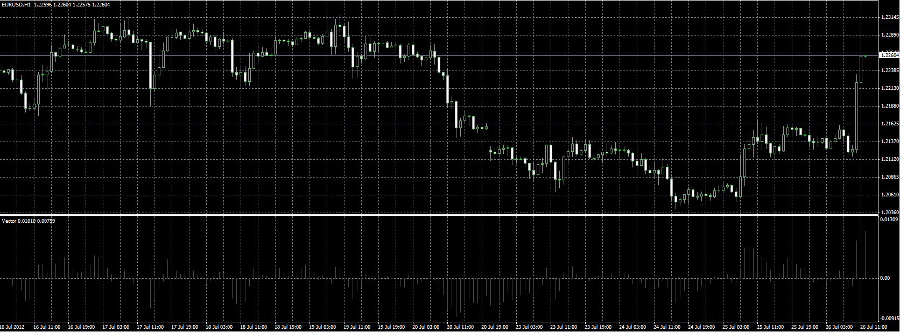

# Vector

> Source: https://fxcodebase.com/code/viewtopic.php?f=38&t=21472  
> Forum: 38 · Topic 21472 · 1 post(s)

---

## Vector

**Alexander.Gettinger** · Fri Jul 27, 2012 3:30 pm

Original indicator: [viewtopic.php?f=17&t=257](https://fxcodebase.com/code/viewtopic.php?f=17&t=257)

> Vector is one of the indicators that I designed and wrote for Marketscope platform.
> Indicator follow the movement of prices, very well, gives relatively few false signals.
>
> Crossover of Vector and zero line generates Buy and Sell signals.
> Buy - Vector > 0
> Sell - Vector < 0
>
> At the same time they are shown two Vector indicators slower (red) and fast (green) lines.
>
> When faster vector completely covers the slower we are at an early stage of formation of a new trend.
> The weakening trend, slower Vector prevails faster, the trend will continue because of inertia.
> Cessation of action of inertia on the movement of the market, inertia is presented with a slower Vector indicator, there are preconditions for the emergence of a new trend, the trend is shown by rapid Vector indicator.
>
> The calculation of individual vectors
> Vector (Slow) = ( Vector(2) + Vector (4) + Vector(8) + Vector (16) ) / 4
> Vector (Fast) = ( 0,50*Vector(2) + 0,25*Vector (4) + 0,125 Vector(8) + 0,0625* Vector (16) )
>
> The calculation of each component vector
> Vector(i) = Close (n) - Close(n-i)
>
> The data are NOT averaged, you can apply EMA for smoothing of the obtained data.
> Personally I prefer this format.

 

Download:

 [Vector.mq4](files/37524/Vector.mq4)
