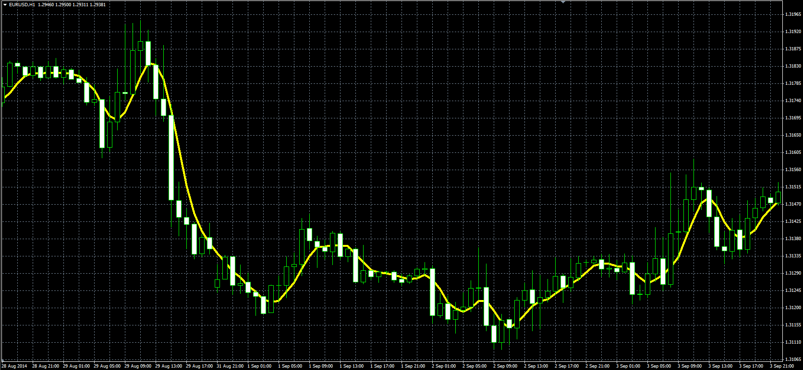

# Velocity and Accerlation Moving Average

> Source: https://fxcodebase.com/code/viewtopic.php?f=38&t=61149  
> Forum: 38 · Topic 61149 · 1 post(s)

---

## Velocity and Accerlation Moving Average

**Alexander.Gettinger** · Mon Sep 15, 2014 12:10 pm

Original LUA indicator: [viewtopic.php?f=17&t=36832](https://fxcodebase.com/code/viewtopic.php?f=17&t=36832).

Formula:
VAMA = EMA+D1+D2/2+D3/6, where
D1[i] = EMA[i]-EMA[i-Length/4],
D2[i] = EMA[i]-2*EMA[i-Length/4]+EMA[i-Length/8],
D3[i] = EMA[i]-3*EMA[i-Length/4]+3*EMA[i-Length/8]-EMA[i-Length/12].

 

Download:

 [VA_MA.mq4](files/95895/VA_MA.mq4)
