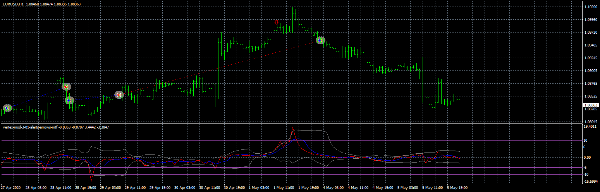

# vertex-mod-3-01-alerts-arrows-mtf

> Source: https://fxcodebase.com/code/viewtopic.php?f=38&t=70133  
> Forum: 38 · Topic 70133 · 6 post(s)

---

## vertex-mod-3-01-alerts-arrows-mtf

**Apprentice** · Mon Jul 06, 2020 1:54 pm

Based on request.
[viewtopic.php?f=27&t=70121](https://fxcodebase.com/code/viewtopic.php?f=27&t=70121)

 [vertex-mod-3-01-alerts-arrows-mtf.mq4](files/135676/vertex-mod-3-01-alerts-arrows-mtf.mq4)

 [vertex-mod-3-01-alerts-arrows-mtf EA.mq4](files/135676/vertex-mod-3-01-alerts-arrows-mtf%20EA.mq4)

---

## Re: vertex-mod-3-01-alerts-arrows-mtf

**signals.kap** · Sun Oct 31, 2021 2:51 pm

it is repainter

---

## Re: vertex-mod-3-01-alerts-arrows-mtf

**tech42day** · Tue Aug 12, 2025 5:42 am

please convert to mt5

---

## Re: vertex-mod-3-01-alerts-arrows-mtf

**Apprentice** · Mon Aug 18, 2025 7:26 am

We have added your request to the development list.
Development reference 529

---

## Re: vertex-mod-3-01-alerts-arrows-mtf

**Apprentice** · Mon Sep 08, 2025 3:41 am

 [vertex-mod-3-01-alerts-arrows-mtf.ex5](files/160487/vertex-mod-3-01-alerts-arrows-mtf.ex5)

 [vertex-mod_EA_v1.00.mq5](files/160487/vertex-mod_EA_v1.00.mq5)

---

## Re: vertex-mod-3-01-alerts-arrows-mtf

**tech42day** · Wed Dec 31, 2025 8:16 am

can you please put mql5 file of vertex
