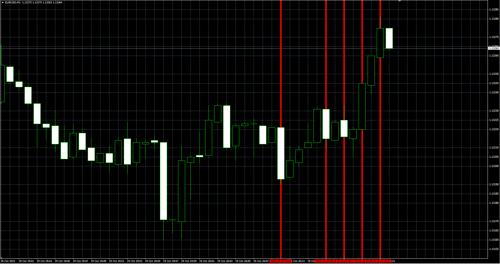

# Vertical lines

> Source: https://fxcodebase.com/code/viewtopic.php?f=38&t=62797  
> Forum: 38 · Topic 62797 · 5 post(s)

---

## Vertical lines

**Alexander.Gettinger** · Mon Oct 19, 2015 2:05 pm

The indicator draws a vertical line with the indents of the first bar.

 

Download:

 [Vertical_Multiline.mq4](files/102923/Vertical_Multiline.mq4)

 [Vertical_Multiline.mq5](files/102923/Vertical_Multiline.mq5)

---

## Re: Vertical lines

**LuckyLucos** · Fri Jan 27, 2023 9:10 am

Hello
It's a very useful indicator for me.
Could you code it in .Mq5?

Thanks.

---

## Re: Vertical lines

**Apprentice** · Tue Jan 31, 2023 6:39 am

We have added your request to the development list.
Development reference 99.

---

## Re: Vertical lines

**Apprentice** · Tue Jan 31, 2023 2:05 pm

Vertical_Multiline.mq5 added.

---

## Re: Vertical lines

**LuckyLucos** · Tue Jan 31, 2023 3:39 pm

Thank You very much.
I missed it to trade with MT5.
