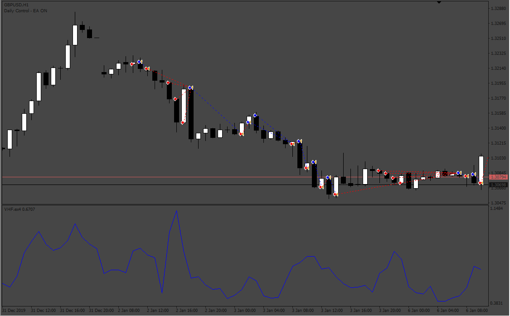
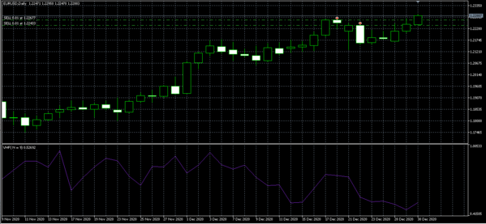
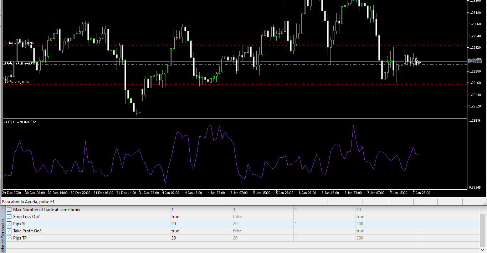

# VHF_EA

> Source: https://fxcodebase.com/code/viewtopic.php?f=38&t=71888  
> Forum: 38 · Topic 71888 · 5 post(s)

---

## VHF_EA

**Apprentice** · Tue Feb 15, 2022 2:53 pm

Based on the request.
[https://fxcodebase.com/code/viewtopic.php?f=27&p=144862](https://fxcodebase.com/code/viewtopic.php?f=27&p=144862)

 [VHF.mq4](files/145050/VHF.mq4)

 [VHF_EA.mq4](files/145050/VHF_EA.mq4)

 [VHF_EA.mq5](files/145050/VHF_EA.mq5)

---

## Re: VHF_EA

**gyrics** · Tue Feb 15, 2022 3:27 pm

Thank you
but am still not able to select small lot sizes per trade on this EA for example i cant select 0.01 per trade

---

## Re: VHF_EA

**Apprentice** · Wed Feb 16, 2022 7:45 am

Your request is added to the development list.
Development reference 106.

---

## Re: VHF_EA

**Apprentice** · Fri Feb 18, 2022 5:38 am

I can use micro lots in this version

 

---

## Re: VHF_EA

**Apprentice** · Fri Apr 01, 2022 1:54 am

 [VHF_EA.mq4](files/145498/VHF_EA.mq4)

 [VHF_EA.mq5](files/145498/VHF_EA.mq5)
