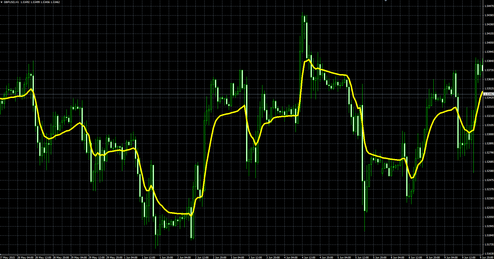
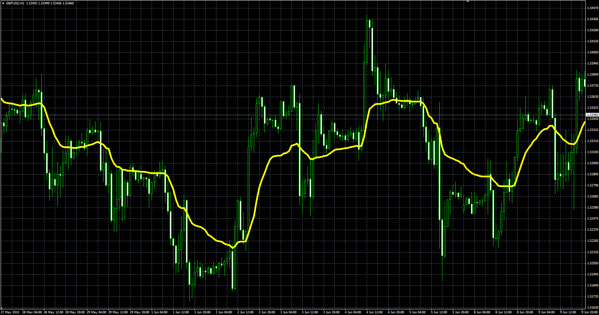

# VIDYA indicator

> Source: https://fxcodebase.com/code/viewtopic.php?f=38&t=62777  
> Forum: 38 · Topic 62777 · 3 post(s)

---

## VIDYA indicator

**Alexander.Gettinger** · Mon Oct 12, 2015 2:24 pm

The VIDYA was developed by Tushar Chande and presented in March, 1992 in “Technical Analysis of Stocks & Commodities” magazine.

**VIDYA92:**
Formula:
VIDYA92[i] = sc*cmo*Price[i]+(1-sc*cmo)*VIDYA92[i-1], where
sc = 2/(1+Short_Length),
cmo = s1/s2,
s1 = StdDev(Price) with [Short_Length] number of periods,
s2 = StdDev(Price) with [Long_Length] number of periods.

 

Download:

 [VIDYA92.mq4](files/102801/VIDYA92.mq4)

**VIDYA:**
Formula:
VIDYA[i] = sc*cmo*Price[i]+(1-sc*cmo)*VIDYA[i-1], where
sc = 2/(1+Length),
cmo = Abs((s1-s2)/(s1+s2)),
s1 = MVA(cmo1) with [Length] number of periods,
s2 = MVA(cmo2) with [Length] number of periods,
cmo1 = diff, if diff>0, else cmo1 = 0,
cmo2 = -diff, if diff<0, else cmo2 = 0,
diff = Price[i]-Price[i-1].

 

Download:

 [VIDYA.mq4](files/102801/VIDYA.mq4)

TS2 version.
[https://fxcodebase.com/code/viewtopic.p ... =301&p=525](https://fxcodebase.com/code/viewtopic.php?f=17&t=301&p=525)

---

## Re: VIDYA indicator

**xristos1982** · Wed Jun 08, 2022 5:56 pm

Can i have this in LUa,please?

---

## Re: VIDYA indicator

**Apprentice** · Fri Jun 10, 2022 5:58 am

TS2 version.
[https://fxcodebase.com/code/viewtopic.p ... =301&p=525](https://fxcodebase.com/code/viewtopic.php?f=17&t=301&p=525)
