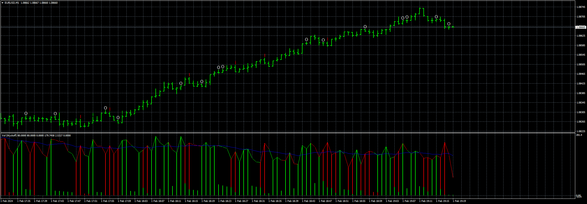

# Vol_(Wyckoff)

> Source: https://fxcodebase.com/code/viewtopic.php?f=38&t=74578  
> Forum: 38 · Topic 74578 · 6 post(s)

---

## Vol_(Wyckoff)

**Apprentice** · Thu Feb 01, 2024 12:20 pm

Based on the request.
[https://fxcodebase.com/code/viewtopic.php?f=17&t=74257](https://fxcodebase.com/code/viewtopic.php?f=17&t=74257)

 [Vol_(Wyckoff).mq4](files/154229/Vol_%28Wyckoff%29.mq4)

---

## Re: Vol_(Wyckoff)

**Fx_xpert** · Wed Aug 21, 2024 4:33 am

Hi Apprentice Sir,

I humbly request to convert this into MT5.

Thanks in advance.

Regards

---

## Re: Vol_(Wyckoff)

**Apprentice** · Wed Aug 21, 2024 4:19 pm

We have added your request to the development list.
Development reference 663

---

## Re: Vol_(Wyckoff)

**Fx_xpert** · Tue Sep 17, 2024 11:12 am

Dear Apprentice,
 Just a reminder & Request again for the conversion of Vol Wyk to Mt5.

Thank You

---

## Re: Vol_(Wyckoff)

**Apprentice** · Wed Jan 15, 2025 5:10 am

 [Vol_(Wyckoff).mq5](files/157821/Vol_%28Wyckoff%29.mq5)

---

## Re: Vol_(Wyckoff)

**Fx_xpert** · Fri Jan 31, 2025 1:08 pm

Many Thanks Apprentice
