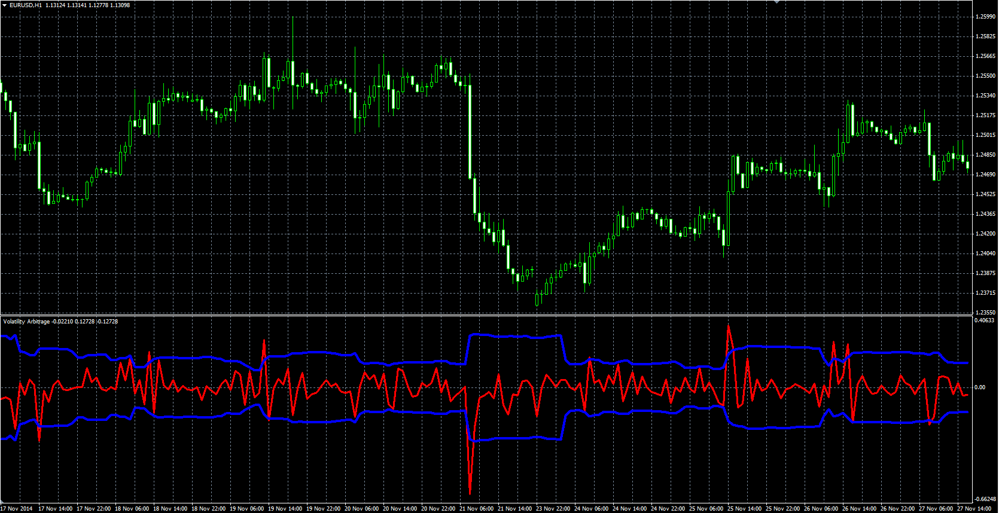

# Volatility Arbitrage

> Source: https://fxcodebase.com/code/viewtopic.php?f=38&t=61858  
> Forum: 38 · Topic 61858 · 1 post(s)

---

## Volatility Arbitrage

**Alexander.Gettinger** · Mon Feb 23, 2015 11:12 am

Original LUA oscillator: [viewtopic.php?f=17&t=61720](https://fxcodebase.com/code/viewtopic.php?f=17&t=61720).

Formulas:
Top = StdDev*Multiplier,
Bottom = -1*Top, where
StdDev - Standard deviation(ROC) with [Length] number of periods,
ROC[i] = 100*(Price[i]/Price[i-ROC_Length]-1).

 

Download:

 [Volatility_Arbitrage.mq4](files/98806/Volatility_Arbitrage.mq4)
