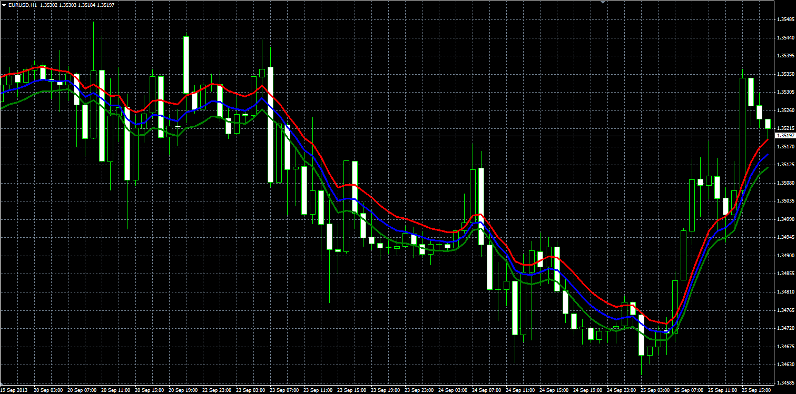

# Volatility band

> Source: https://fxcodebase.com/code/viewtopic.php?f=38&t=59600  
> Forum: 38 · Topic 59600 · 1 post(s)

---

## Volatility band

**Alexander.Gettinger** · Mon Sep 30, 2013 10:01 am

Original LUA indicator: [viewtopic.php?f=17&t=59444](https://fxcodebase.com/code/viewtopic.php?f=17&t=59444).

Formulas:
Middle = EMA(Length_Vol_Band, Typical price),
Lower = Middle-devLow,
Upper = Middle+devHigh, where
devLow = devHigh*Low_Band_Adjust,
devHigh = EMA(Length_Vol_Band, V_Value),
V_Value = MVA(tpSeries, Length_Vol)/Dev_Factor,
tpSeries[i] = Typical price[i] - Low price[i-1] if Typical price[i]>=Typical price[i-1],
tpSeries[i] = Typical price[i+1] - Low price[i] if Typical price[i]<Typical price[i-1].

 

Download:

 [Volatility_Band.mq4](files/89789/Volatility_Band.mq4)

**Volatility_Band2:**

Formulas:
Middle = EMA(Length_Vol_Band, Typical price),
Lower = Middle-dev,
Upper = Middle+dev, where
dev = EMA(Length_Vol_Band, V_Value)*Band_Adjust.

Download:

 [Volatility_Band2.mq4](files/89789/Volatility_Band2.mq4)
