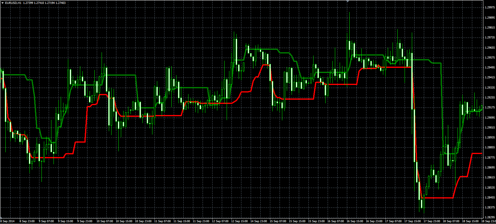

# Volatility Channel by Larry Williams

> Source: https://fxcodebase.com/code/viewtopic.php?f=38&t=61453  
> Forum: 38 · Topic 61453 · 1 post(s)

---

## Volatility Channel by Larry Williams

**Alexander.Gettinger** · Mon Nov 17, 2014 5:14 pm

Original LUA indicator: [viewtopic.php?f=17&t=22632](https://fxcodebase.com/code/viewtopic.php?f=17&t=22632).

Formulas:
Top[i] = Max(MaxT, T[i]),
Bottom[i] = Min(MinB, B[i]), where
T[i] = 2*Typical[i]-High[i],
B[i] = 2*Typical[i]-Low[i],
MinB = minimum value of B at range from (i-Length+1) to (i),
MaxT = maximum value of T at range from (i-Length+1) to (i),
Typical - typical price.

 

Download:

 [VC.mq4](files/97123/VC.mq4)
