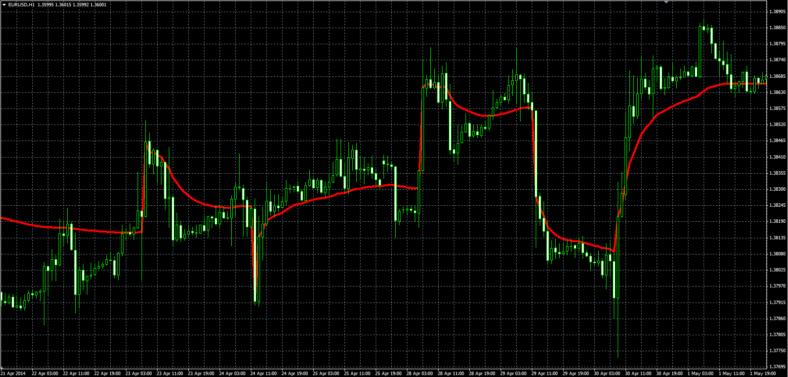

# Volatility Moving Average

> Source: https://fxcodebase.com/code/viewtopic.php?f=38&t=60761  
> Forum: 38 · Topic 60761 · 3 post(s)

---

## Volatility Moving Average

**Alexander.Gettinger** · Mon Jun 02, 2014 4:59 pm

Original LUA indicator: [viewtopic.php?f=17&t=60418](https://fxcodebase.com/code/viewtopic.php?f=17&t=60418).

 

Download:

 [VolatilityMA.mq4](files/94279/VolatilityMA.mq4)

---

## Re: Volatility Moving Average

**xyz1453** · Sun Aug 24, 2014 1:35 pm

Hi ,

Is this recalculating?

---

## Re: Volatility Moving Average

**Apprentice** · Mon Aug 25, 2014 2:56 am

I just test Original LUA indicator. No recalculation there.
