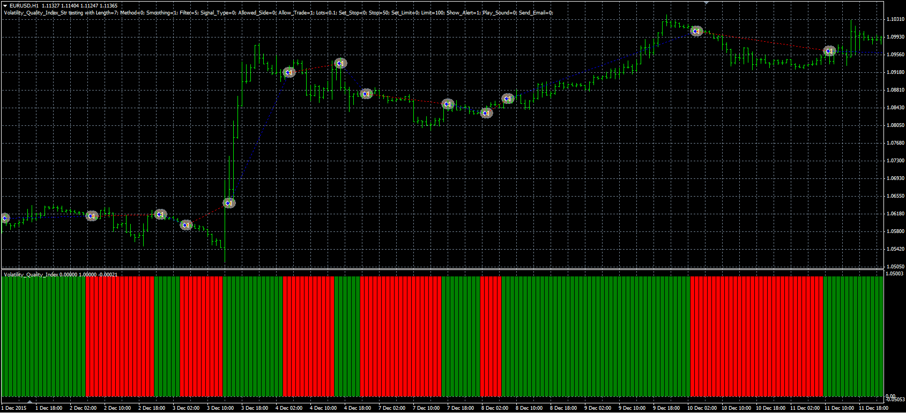

# Volatility Quality Index strategy

> Source: https://fxcodebase.com/code/viewtopic.php?f=38&t=63588  
> Forum: 38 · Topic 63588 · 1 post(s)

---

## Volatility Quality Index strategy

**Alexander.Gettinger** · Thu Jun 09, 2016 5:17 pm

The strategy based on the Volatility Quality Index ([viewtopic.php?f=38&t=63573](https://fxcodebase.com/code/viewtopic.php?f=38&t=63573)).

 

Download:

 [VQI_Str.mq4](files/106706/VQI_Str.mq4)

The Volatility Quality Index ([viewtopic.php?f=38&t=63573](https://fxcodebase.com/code/viewtopic.php?f=38&t=63573)) should be installed for correct work.
