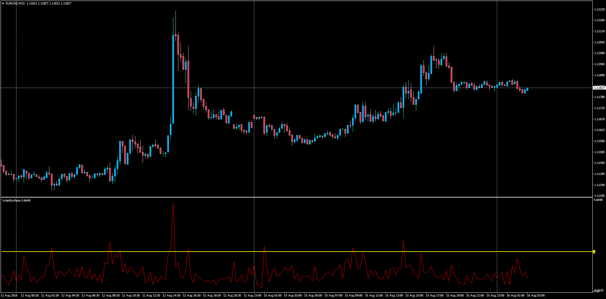

# Volatility Ratio Oscillator

> Source: https://fxcodebase.com/code/viewtopic.php?f=38&t=63770  
> Forum: 38 · Topic 63770 · 1 post(s)

---

## Volatility Ratio Oscillator

**Apprentice** · Tue Aug 16, 2016 2:09 am

Based on the lua original.
[viewtopic.php?f=17&t=1126](https://fxcodebase.com/code/viewtopic.php?f=17&t=1126)

This ratio is used to identify wide-ranging days.
Wide ranging days are signaled by a Volatility Ratio greater than 2.0.

Identifies
1. Wide-ranging days, signals a likely reversal
2. Price gaps
3. Island Price pattern

Formula
Volatility Ratio = True Range / EMA of True Range for the past n periods

 [VR.mq4](files/107639/VR.mq4)
