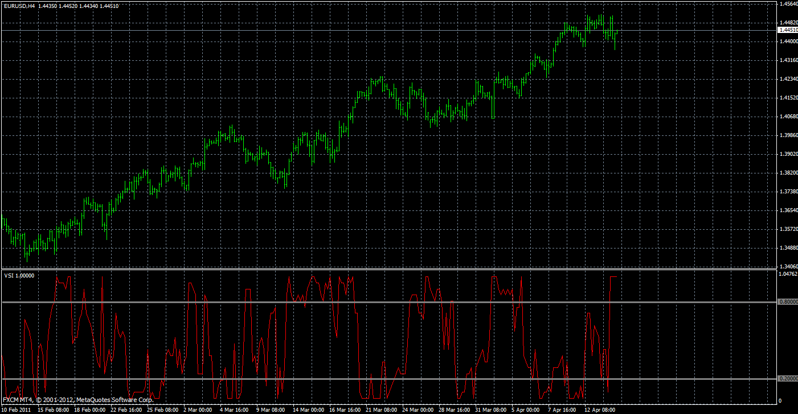

# Volatility (Regime) Switch Indicator

> Source: https://fxcodebase.com/code/viewtopic.php?f=38&t=33981  
> Forum: 38 · Topic 33981 · 1 post(s)

---

## Volatility (Regime) Switch Indicator

**Apprentice** · Sat Mar 30, 2013 6:45 pm

“The Volatility (Regime) Switch Indicator” as described in February 2013 issue of Technical Analysis of Stocks and Commodities by author Ron McEwan.

 [VSI.mq4](files/57710/VSI.mq4)
