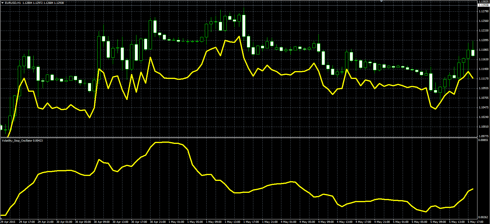

# Volatility Stop

> Source: https://fxcodebase.com/code/viewtopic.php?f=38&t=62201  
> Forum: 38 · Topic 62201 · 1 post(s)

---

## Volatility Stop

**Alexander.Gettinger** · Fri May 08, 2015 10:27 am

Original LUA indicator: [viewtopic.php?f=17&t=62116](https://fxcodebase.com/code/viewtopic.php?f=17&t=62116).

Formula:
VS[i] = Multiplier*HiLoAvg/Close[i], where
HiLoAvg = MA_H-MA_L,
MA_H - MVA(High) with [Length] number of periods,
MA_L - MVA(Low) with [Length] number of periods.

 

Download:

 [Volatility_Stop_Oscillator.mq4](files/100364/Volatility_Stop_Oscillator.mq4)

 [Volatility_Stop.mq4](files/100364/Volatility_Stop.mq4)
