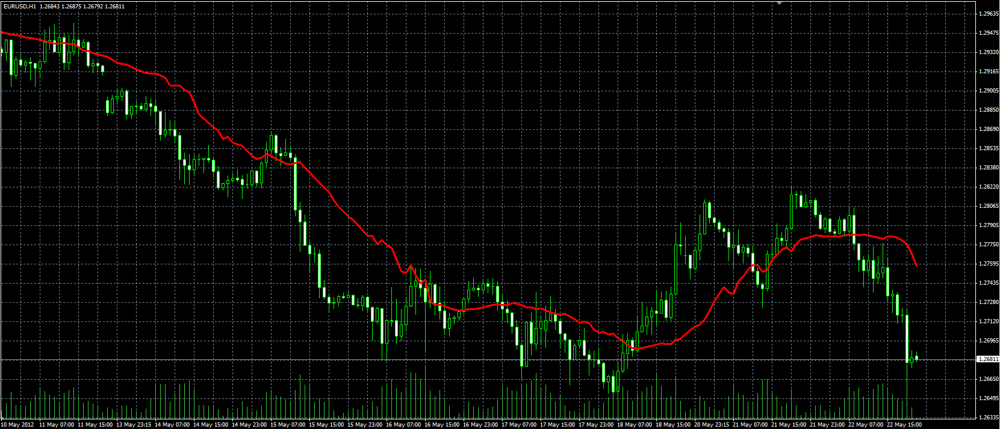

# VolMA indicator

> Source: https://fxcodebase.com/code/viewtopic.php?f=38&t=18974  
> Forum: 38 · Topic 18974 · 1 post(s)

---

## VolMA indicator

**Alexander.Gettinger** · Tue May 22, 2012 4:20 pm

Formulas:
VolMA=MVA(Price), where
Period of MVA=RSI(Volume)*[Period]/100.

 

Download:

 [VolMA.mq4](files/33828/VolMA.mq4)
