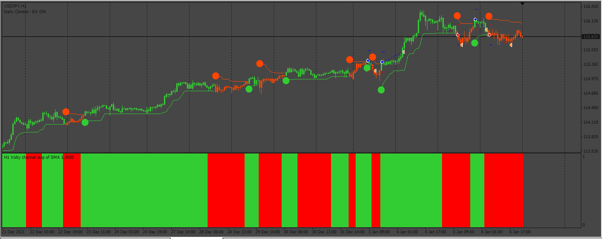

# Volt_EA

> Source: https://fxcodebase.com/code/viewtopic.php?f=38&t=74496  
> Forum: 38 · Topic 74496 · 7 post(s)

---

## Volt_EA

**Apprentice** · Thu Dec 28, 2023 5:32 am

Based on the request.
[https://fxcodebase.com/code/viewtopic.p ... 48#p153748](https://fxcodebase.com/code/viewtopic.php?f=27&p=153748#p153748)

 [Volty_Channel_Stop_averages_(mtf_+_arrows).ex4](files/153829/Volty_Channel_Stop_averages_%28mtf__arrows%29.ex4)

 [ATR_-_Stops1.01_(mtf_+_alerts).mq4](files/153829/ATR_-_Stops1.01_%28mtf__alerts%29.mq4)

 [Volt_EA.mq4](files/153829/Volt_EA.mq4)

---

## Re: Volt_EA

**mahi kahn** · Thu Dec 28, 2023 12:36 pm

DEAR coder pleas make this indicator EA only and add close all in opposite signal
ATR_-_Stops1.01_(mtf_+_alerts).mq4

---

## Re: Volt_EA

**Apprentice** · Tue Jan 02, 2024 12:54 pm

We have added your request to the development list.
Development reference 17

---

## Re: Volt_EA

**Apprentice** · Sat Jan 06, 2024 2:39 am

Try this version.
[https://fxcodebase.com/code/viewtopic.php?f=38&t=74513](https://fxcodebase.com/code/viewtopic.php?f=38&t=74513)

---

## Re: Volt_EA

**nablito** · Tue Jan 16, 2024 11:47 am

Is it possible to add a button to show/hide this indicator?

ATR_-_Stops1.01_(mtf_+_alerts).mq4

thanks

---

## Re: Volt_EA

**Apprentice** · Sat Jan 20, 2024 4:37 am

We have added your request to the development list.
Development reference 85

---

## Re: Volt_EA

**Apprentice** · Tue Jun 25, 2024 11:24 am

[ATR_-_Stops1.01_(mtf_+_alerts_+_btn).mq4](files/155896/ATR_-_Stops1.01_%28mtf__alerts__btn%29.mq4)

Try this version.
