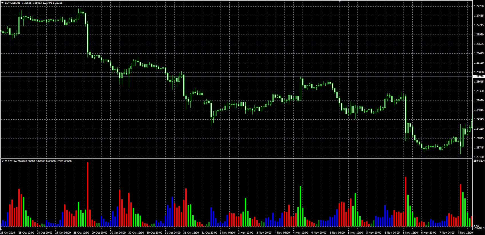

# Voltest (VLM) oscillator

> Source: https://fxcodebase.com/code/viewtopic.php?f=38&t=61492  
> Forum: 38 · Topic 61492 · 1 post(s)

---

## Voltest (VLM) oscillator

**Alexander.Gettinger** · Thu Nov 20, 2014 10:12 am

Original LUA oscillator: [viewtopic.php?f=17&t=12322](https://fxcodebase.com/code/viewtopic.php?f=17&t=12322).

Formulas:
VLM = Volume/VolAvg, where
VolAvg = MVA(Volume) with [Length] number of periods.

 

Download:

 [VLM.mq4](files/97220/VLM.mq4)
