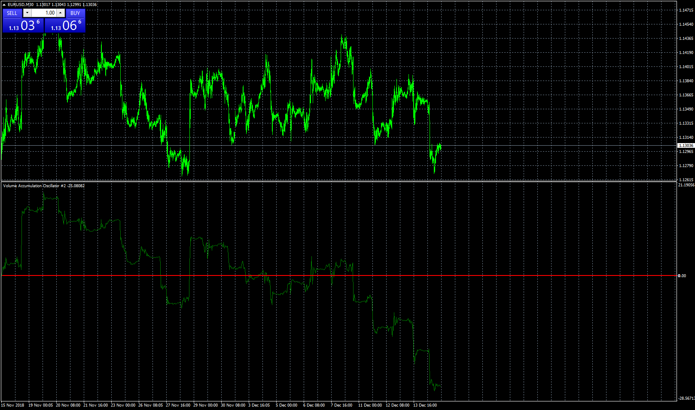
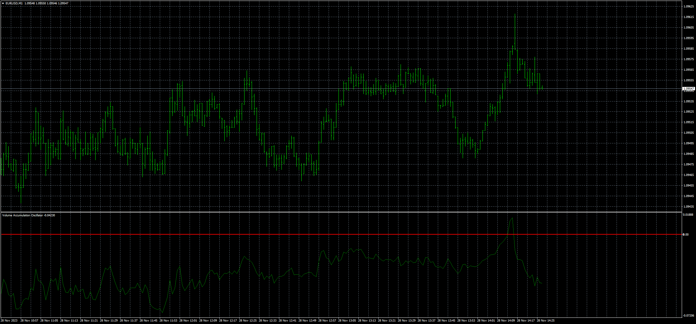

# Volume Accumulation Oscillator

> Source: https://fxcodebase.com/code/viewtopic.php?f=38&t=67170  
> Forum: 38 · Topic 67170 · 8 post(s)

---

## Volume Accumulation Oscillator

**Apprentice** · Sat Dec 15, 2018 7:50 am

Based on request.
[viewtopic.php?f=27&t=67161](https://fxcodebase.com/code/viewtopic.php?f=27&t=67161)

 [Volume Accumulation Oscillator.mq4](files/122869/Volume%20Accumulation%20Oscillator.mq4)

 [Volume_Accumulation_Oscillator.mq5](files/122869/Volume_Accumulation_Oscillator.mq5)

---

## Re: Volume Accumulation Oscillator

**logicgate** · Sat Dec 15, 2018 8:37 am

Dear friend Apprentice, you are the best!!

Thanks so much and God Bless! Good profitable trading!

---

## Re: Volume Accumulation Oscillator

**logicgate** · Tue Jul 20, 2021 7:01 am

Hi there buddy, can we get a MT5 version of this indicator?

Thanks

---

## Re: Volume Accumulation Oscillator

**Apprentice** · Wed Jul 21, 2021 12:19 am

Your request is added to the development list.
Development reference 670.

---

## Re: Volume Accumulation Oscillator

**Apprentice** · Tue Jul 27, 2021 3:29 am

Volume_Accumulation_Oscillator.mq5 added.

---

## Re: Volume Accumulation Oscillator

**naluvs01** · Tue Nov 07, 2023 6:35 am

> **Apprentice wrote:**
>
>
> eurusd-m30-leverate.png
>
>
> Based on request.
> [viewtopic.php?f=27&t=67161](https://fxcodebase.com/code/viewtopic.php?f=27&t=67161)
>
>
> Volume Accumulation Oscillator.mq4
>
>
>
>
> Volume_Accumulation_Oscillator.mq5

Hi Apprentice,

This is probably the best Volume indicator I have ever seen. Is it possible to make a lite version. Every time I switch to a different pair, it takes almost a minute or two before the pair loads. Thank you for a great indicator!!!!

---

## Re: Volume Accumulation Oscillator

**Apprentice** · Fri Nov 10, 2023 3:14 pm

We have added your request to the development list.
Development reference 1006

---

## Re: Volume Accumulation Oscillator

**Apprentice** · Tue Nov 28, 2023 7:28 am

 [Volume_Accumulation_Oscillator.mq4](files/153435/Volume_Accumulation_Oscillator.mq4)
