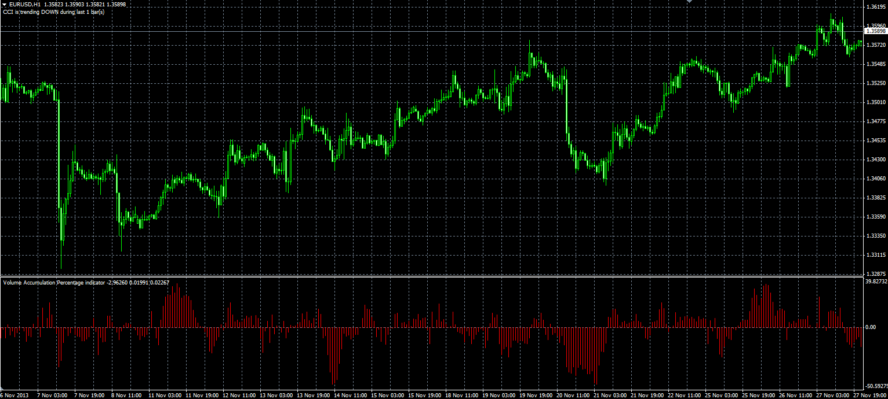

# Volume Accumulation Percentage Indicator

> Source: https://fxcodebase.com/code/viewtopic.php?f=38&t=60045  
> Forum: 38 · Topic 60045 · 1 post(s)

---

## Volume Accumulation Percentage Indicator

**Alexander.Gettinger** · Mon Dec 02, 2013 10:43 am

Original LUA oscillators: [viewtopic.php?f=17&t=59830&p=90707](https://fxcodebase.com/code/viewtopic.php?f=17&t=59830&p=90707).

 

Download:

 [Volume_Accumulation.mq4](files/91295/Volume_Accumulation.mq4)

 [Volume_Accumulation_Percentage.mq4](files/91295/Volume_Accumulation_Percentage.mq4)
