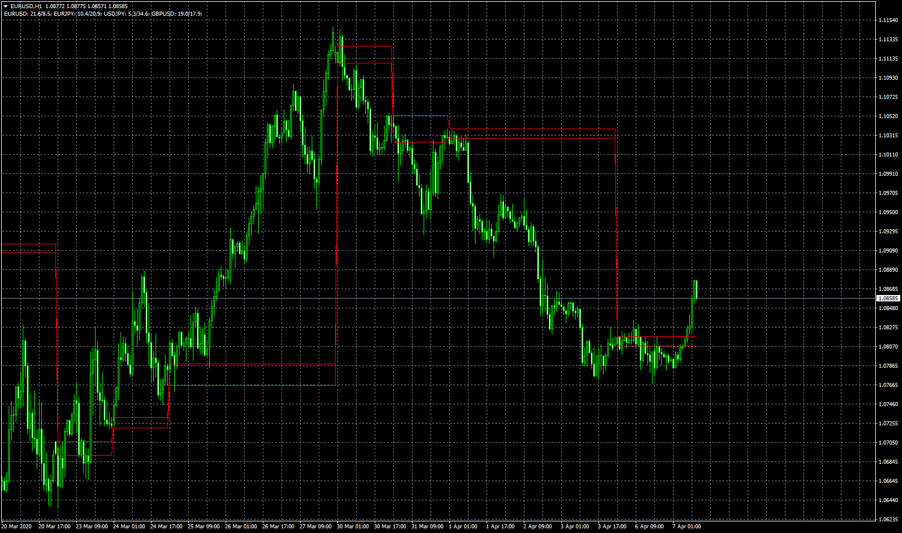

# Volume Based SR

> Source: https://fxcodebase.com/code/viewtopic.php?f=38&t=69628  
> Forum: 38 · Topic 69628 · 5 post(s)

---

## Volume Based SR

**Apprentice** · Tue Apr 07, 2020 5:25 am

Based on request.
[viewtopic.php?f=27&t=69619](https://fxcodebase.com/code/viewtopic.php?f=27&t=69619)

 [Volume Based SR.mq4](files/132620/Volume%20Based%20SR.mq4)

---

## Re: Volume Based SR

**aladdin007** · Tue Apr 07, 2020 1:52 pm

Thank you so much bro
God bless you

---

## Re: Volume Based SR

**rubbbo** · Tue Apr 14, 2020 4:15 pm

Hello!

Thank you for this indicator.

May I please ask to be modified in order to show the indicator buffers 0,1 for the leveluphi and leveluplo?

Thank you so much
Rub

---

## Re: Volume Based SR

**Apprentice** · Wed Apr 15, 2020 1:17 pm

Your request is added to the development list.
Development reference 1069.

---

## Re: Volume Based SR

**Apprentice** · Wed Apr 22, 2020 11:08 am

They are already visible.
