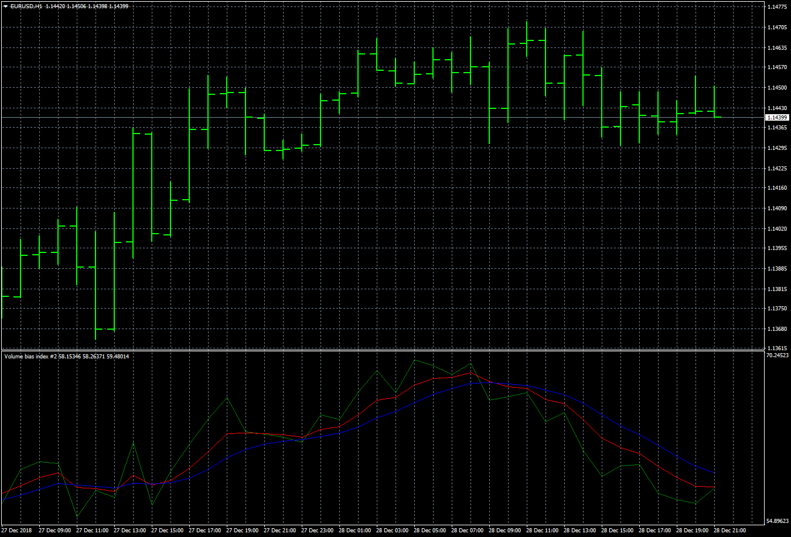

# Volume bias index

> Source: https://fxcodebase.com/code/viewtopic.php?f=38&t=67222  
> Forum: 38 · Topic 67222 · 6 post(s)

---

## Volume bias index

**Apprentice** · Sun Dec 30, 2018 8:34 am

Based on TS2/Lua
[viewtopic.php?f=17&t=67221](https://fxcodebase.com/code/viewtopic.php?f=17&t=67221)

 [Volume bias index.mq4](files/123093/Volume%20bias%20index.mq4)

---

## Re: Volume bias index

**logicgate** · Sun Dec 30, 2018 10:34 am

That was fast!! Thanks so much!

---

## Re: Volume bias index

**logicgate** · Sun Dec 30, 2018 10:37 am

You didn't hard code the levels on the MT4 version? (the overbought, oversold and neutral zones) I noticed you did in the lua version.

---

## Re: Volume bias index

**alienfriend18** · Sun May 31, 2020 9:53 am

Please add..
1.Multi timeframe option
2. Multipair option
3.alert-when triggerline(hopefully blue one) crosses 50

---

## Re: Volume bias index

**Apprentice** · Mon Jun 01, 2020 5:07 am

Your request is added to the development list.
Development reference 1402.

---

## Re: Volume bias index

**Apprentice** · Mon Jun 15, 2020 4:02 am

[Volume_bias_index_MTF.mq4](files/134947/Volume_bias_index_MTF.mq4)

Try this version.
