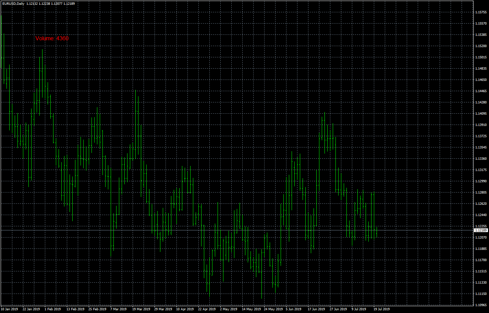

# Volume Display

> Source: https://fxcodebase.com/code/viewtopic.php?f=38&t=68838  
> Forum: 38 · Topic 68838 · 7 post(s)

---

## Volume Display

**Apprentice** · Fri Aug 23, 2019 5:36 am

Based on request.
[viewtopic.php?f=27&t=68681](https://fxcodebase.com/code/viewtopic.php?f=27&t=68681)

 [Volume Display.mq4](files/128152/Volume%20Display.mq4)

 [Volume Display.mq5](files/128152/Volume%20Display.mq5)

---

## Re: Volume Display

**logicgate** · Fri Aug 23, 2019 8:41 am

Perfect, thanks!

---

## Re: Volume Display

**fgtr1818** · Fri Dec 18, 2020 1:53 am

brother for mt5 is available?? PLEASE...

---

## Re: Volume Display

**Apprentice** · Fri Dec 18, 2020 5:13 am

Your request is added to the development list.
Development reference 2490.

---

## Re: Volume Display

**Apprentice** · Mon Dec 21, 2020 2:58 am

Volume Display.mq5 added

---

## Re: Volume Display

**fgtr1818** · Sun Dec 27, 2020 2:11 am

Thanks for your contribution friend, if I make a request for a specific mq4 can you develop it for mq5?

---

## Re: Volume Display

**Apprentice** · Sun Dec 27, 2020 3:35 pm

Sure, we can develop addons for both platforms.
