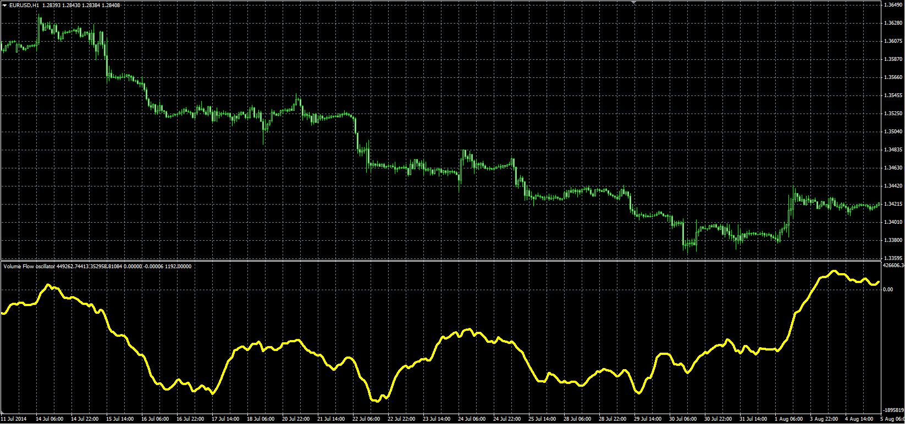
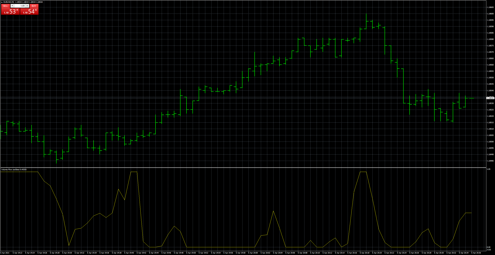

# Volume Flow oscillator

> Source: https://fxcodebase.com/code/viewtopic.php?f=38&t=61253  
> Forum: 38 · Topic 61253 · 10 post(s)

---

## Volume Flow oscillator

**Alexander.Gettinger** · Thu Sep 25, 2014 9:43 am

Original LUA oscillator: [viewtopic.php?f=17&t=27497](https://fxcodebase.com/code/viewtopic.php?f=17&t=27497).

 

Download:

 [VFI.mq4](files/96197/VFI.mq4)

---

## Re: Volume Flow oscillator

**durlovjagiroad** · Sun Mar 08, 2020 2:58 am

Multitimeframe and Multipair option to change symbol required.

Thanks in advance

---

## Re: Volume Flow oscillator

**Apprentice** · Mon Mar 09, 2020 6:42 am

Your request is added to the development list.
Development reference 838.

---

## Re: Volume Flow oscillator

**Apprentice** · Tue Mar 10, 2020 6:32 am

[VFI Other Symbol.mq4](files/131842/VFI%20Other%20Symbol.mq4)

Try this version.

---

## Re: Volume Flow oscillator

**PURABI** · Sun Sep 06, 2020 2:16 am

Want an average VFI indicator for multiple symbols.
with Multi time frame option

Suppose
VFI value of symbol-A=-600
symbol-B=500
symbol-C=1000
symbol -D=1300
Symbol-E=-300
Symbol-F=-400
The Final VFI indicator should be based on the average VFI values of the input symbols...

---

## Re: Volume Flow oscillator

**Apprentice** · Mon Sep 07, 2020 2:00 am

Your request is added to the development list.
Development reference 1984.

---

## Re: Volume Flow oscillator

**Apprentice** · Thu Sep 10, 2020 2:23 am

[VFI_Final.mq4](files/137513/VFI_Final.mq4)

Try this version.

---

## Re: Volume Flow oscillator

**alienfriend18** · Sat Mar 27, 2021 11:48 am

> **Apprentice wrote:**
>
>
> VFI_Final.mq4
>
>
> Try this version.

 Please Normalize the VFI_Final indicator in 0-100 range. Thanks

---

## Re: Volume Flow oscillator

**Apprentice** · Sat Mar 27, 2021 3:59 pm

Your request is added to the development list.
Development reference 318.

---

## Re: Volume Flow oscillator

**Apprentice** · Tue Apr 06, 2021 12:36 pm

 [VFI_Final_Normilized.mq4](files/141412/VFI_Final_Normilized.mq4)
