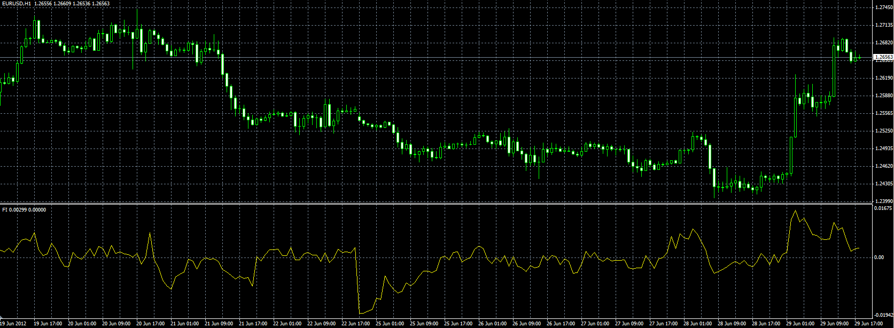

# Volume Indicator : Elder's Force Index

> Source: https://fxcodebase.com/code/viewtopic.php?f=38&t=20679  
> Forum: 38 · Topic 20679 · 1 post(s)

---

## Volume Indicator : Elder's Force Index

**Alexander.Gettinger** · Fri Jun 29, 2012 1:42 pm

Original indicator: [viewtopic.php?f=17&t=1966](https://fxcodebase.com/code/viewtopic.php?f=17&t=1966)

> Developed by Dr Alexander Elder, the Force index combines price movements and volume to measure the strength of bulls and bears in the market. The raw index is rather erratic and better results are achieved by smoothing with a 2-day or 13-day exponential moving average (EMA).
>
> The 2-day EMA of Force is used to track the strength of buyers and sellers in the short term;
> The 13-day EMA of Force measures the strength of bulls and bears in intermediate cycles.
>
> If the Force index is above zero it signals that the bulls are in control. Negative Force index signals that the bears are in control. If the index whipsaws around zero it signals that neither side has control and no strong trend exists.
>
> Formula:
> FI(N) = EMA((Close - Close[Previouis]) * Volume, N);

 

Download:

 [aefi.mq4](files/36259/aefi.mq4)
